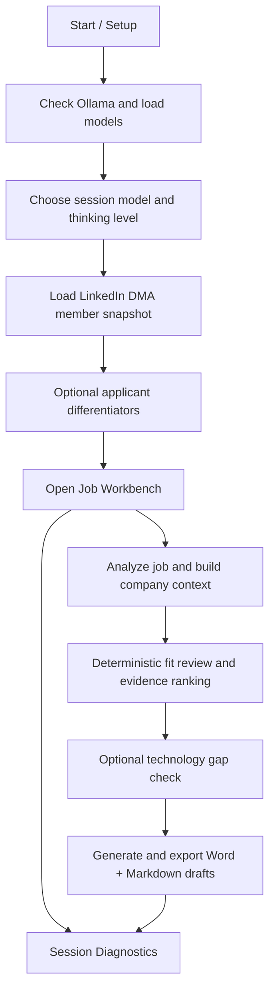

# LI CV Writer

Local-first AI-powered CV generation from LinkedIn data.

## Overview

LI CV Writer is a local-first Blazor application that imports your LinkedIn profile through the DMA Portability API, analyzes target job postings, reviews candidate-job fit, ranks supporting evidence, and generates tailored application documents — all running on your machine with a local LLM via Ollama.

The application walks a senior professional through a structured pipeline: establish a session with a local model, import the full LinkedIn member snapshot, optionally capture applicant differentiators (manually or from an Insights Discovery PDF), then open parallel job tabs where each target role gets its own research, fit review, evidence ranking, technology gap analysis, and multi-document generation. The output is a set of ATS-friendly Word (.docx) and Markdown files ready for direct submission.

No data leaves your machine. The LinkedIn token is used once for import and discarded, the LLM runs locally through Ollama, and all generated files are written to a local export folder. The application is designed as a productivity tool for senior consulting and technology professionals targeting roles where evidence-grounded, keyword-optimized application material makes a measurable difference.

## Tech Stack

| Layer | Technology |
| --- | --- |
| Runtime | .NET 10 / C# 14 |
| Web framework | Blazor Server (interactive SSR) |
| LLM inference | Ollama (local, `http://localhost:11434`) |
| Architecture | Domain-Driven Design — Core → Application → Infrastructure → Web |
| Profile import | LinkedIn DMA Portability API (`r_dma_portability_self_serve`) |
| Word export | OpenXml SDK + HtmlToOpenXml + Markdig (Markdown → HTML → DOCX) |
| Document styling | Built-in Word heading styles, Calibri, single-column ATS layout |
| Testing | xUnit, 125+ tests |

## Key Features

- **LinkedIn DMA member snapshot import** — typed mapping of experience, education, skills, certifications, projects, recommendations, and enrichment domains
- **LLM-powered job analysis** — structured parsing of job postings and company context pages
- **Deterministic fit review** — apply / stretch / skip scoring with grounded signal matching
- **Ranked evidence selection** — interactive evidence ranking by requirement alignment, differentiator alignment, and recommendation strength
- **Technology gap analysis** — surfaces underrepresented technologies from the target role
- **Multi-document generation** — CV, cover letter, profile summary, and interview notes per job tab
- **Word + Markdown export** — ATS/AI-friendly .docx with built-in heading styles, keyword-rich professional profile, and all recommendations with language detection and translation annotation
- **Applicant differentiator profiling** — manual capture or automated drafting from Insights Discovery PDF
- **Session diagnostics** — live LLM telemetry, import diagnostics, and audit trail
- **Workspace recovery** — session state persists across restarts

## Workflow



## Prerequisites

- .NET 10 SDK
- Ollama running locally at `http://localhost:11434`
- At least one locally installed Ollama model
- A LinkedIn DMA portability access token with `r_dma_portability_self_serve` — see the [LinkedIn DMA docs](https://learn.microsoft.com/en-us/linkedin/dma/member-data-portability/member-data-portability-member/?view=li-dma-data-portability-2025-11)

## Running Locally

```powershell
dotnet run --project .\src\LiCvWriter.Web\LiCvWriter.Web.csproj
```

## Secrets

No secrets live in source-controlled files.

- **DMA access token** — pasted at runtime for a single import, not persisted
- **Ollama base URL and model** — regular configuration, not secrets
- **Insights Discovery PDFs** — processed in memory only, not persisted

## GitHub Safety Check

Before pushing, verify that only intended source files are indexed:

```powershell
pwsh .\scripts\Verify-GitHubPushSafety.ps1
```

The script audits tracked and staged files and fails on build output, machine-specific paths, or secret-like content.

## Detailed Walkthrough

For the full architecture reference, data flows, Mermaid diagrams, and implementation details, see [docs/details.md](docs/details.md).

## License

See [LICENSE](LICENSE).
