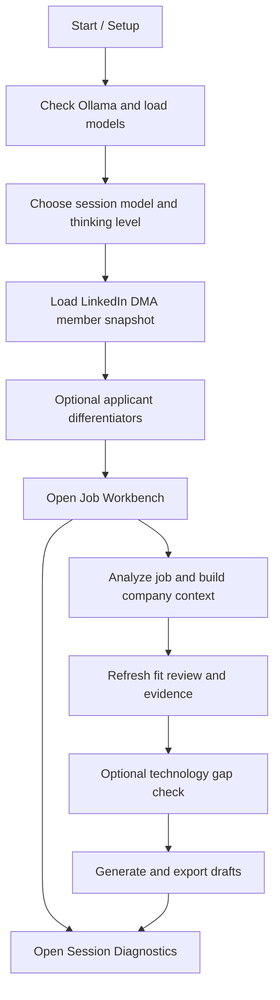
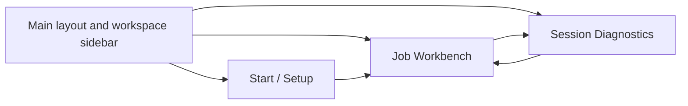
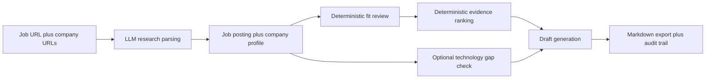

# LI CV Writer

Local-first Blazor application for importing LinkedIn profile data, analyzing job postings, reviewing job fit, selecting supporting evidence, and producing targeted CV material for senior consulting roles.

## Current status

This repository has an initial implementation scaffold with:

- a Blazor Web App host
- domain, application, infrastructure, and test projects
- a LinkedIn DMA member snapshot importer that stages data into the existing profile-mapping pipeline
- an Ollama client targeting `http://localhost:11434/api`
- structured job-fit review with apply/stretch/skip scoring
- applicant differentiator capture on Start / Setup
- optional Insights Discovery PDF upload that drafts applicant differentiators in memory with the session LLM
- ranked evidence selection per job tab to steer generation

## Prerequisites

- .NET 10 SDK
- Ollama running locally at `http://localhost:11434`
- at least one locally installed Ollama model that can be selected during Start / Setup
- a LinkedIn DMA portability access token with `r_dma_portability_self_serve`, see https://learn.microsoft.com/en-us/linkedin/dma/member-data-portability/member-data-portability-member/?view=li-dma-data-portability-2025-11 for more

## Planned secrets

The application is designed so that secrets do not live in source-controlled files.

- DMA access token: pasted at runtime for a single import and not persisted by the app
- Ollama base URL and model: regular configuration, not secrets
- Insights Discovery PDFs and extracted source text: processed in memory only and not persisted by the app

## Current workflow

1. Check Ollama and choose the session model and thinking level.
2. Load profile data from the LinkedIn DMA member snapshot API with a portability token.
3. Optionally upload an Insights Discovery PDF to auto-draft applicant differentiators, or capture them manually on Start / Setup.
4. Open the Job Workbench and analyze a target role and company context.
5. Review the structured fit assessment and ranked evidence for the active job tab.
6. Optionally run the technology gap check for the active job tab.
7. Generate CV, cover letter, profile summary, and interview notes using the selected evidence.

For LinkedIn DMA portability imports, the app accepts a static access token with `r_dma_portability_self_serve` and queries the member snapshot APIs to synthesize the candidate-profile shape used across the app.

## Application flow

The application is designed around a single session that starts on Start / Setup, stores shared session context in memory, and then lets you work each target role in its own job tab. The short version below is aimed at end users. For the deeper maintainer and contributor walkthrough, see [docs/application-flow.md](docs/application-flow.md).

### Flow at a glance



### Navigation overview



### 1. Start / Setup

Start / Setup is the session entry point. It is where you establish the LLM session, import the LinkedIn DMA member snapshot, and optionally capture an applicant-differentiator profile that will steer later fit review and generation.

The first card checks the local Ollama service, loads the available models, and lets you store one model plus a thinking level in session memory only. Once LLM-backed work begins, those session settings stop being editable for the current session. The second card imports the LinkedIn DMA member snapshot directly from LinkedIn using a portability token. The third card lets you either type differentiator notes manually or upload an Insights Discovery PDF and let the session model draft those notes for you.

### 2. LinkedIn DMA import

The LinkedIn import stage builds the candidate profile used across the rest of the app. It maps core DMA domains into typed profile fields such as experience, education, skills, certifications, projects, and recommendations. Additional supported enrichment domains are summarized into note-like `ManualSignals`, while explicitly ignored domains stay out of the profile and diagnostics views.

After import, Start / Setup shows the imported profile summary and the rest of the app can use that candidate data. Importing a new profile also resets downstream fit review, technology gap, evidence-selection, and generated-document state so later outputs are always grounded in the latest imported profile.

### 3. Optional applicant differentiators

Applicant differentiators are optional session-level notes about work style, communication, leadership, stakeholders, motivators, target narrative, watchouts, and supporting proof points. These notes are not required to use the app, but when present they influence fit framing and draft generation.

If you upload an Insights Discovery PDF, the file is processed in memory, the extracted text is sent through the selected session model, and the resulting differentiator fields replace the current form values only on success. The uploaded PDF and extracted raw text are not persisted by the app.

### 4. Job Workbench

The Job Workbench is where the session-global context from Start / Setup is combined with job-tab-local context. Each job tab keeps its own target job URL, company-context URLs, parsed job snapshot, company profile, fit review, ranked evidence, technology gap result, output language, and exported files.

The workbench now uses one combined research action. You provide a job URL and one or more company-context URLs, then run a single action that first analyzes the job page and then builds the company context. That combined result becomes the basis for fit review, evidence ranking, technology gap checks, and generation.



### 5. Fit review and evidence selection

Fit review and evidence selection are deterministic once the profile and parsed job context are available. The app compares your candidate profile against the target role requirements, assigns apply/stretch/skip guidance, and then ranks evidence items from the imported profile so the later drafts can be steered by the strongest matching material.

Evidence selection is interactive. The app preselects a ranked set of evidence items, but you can change those selections before generating drafts. The selected evidence is what later flows into CV, cover letter, summary, and interview-note generation.

### 6. Technology gap check and generation

The technology gap check is optional and focuses on technologies that appear in the target role context but may be underrepresented in the imported profile. Draft generation is the final LLM-backed stage. It uses the selected output language, the stored profile, the parsed job and company context, the fit review summary, the selected evidence, and any applicant differentiators to generate markdown outputs for the current job tab.

Generated documents can be exported to local markdown files, and the generation step also writes an audit record so the output history remains traceable.

### 7. Session diagnostics and recovery

The Session Diagnostics page is the deeper inspection surface. It shows the current LLM telemetry, session context, LinkedIn import diagnostics, warnings, mapped files, imported experience preview, enrichment notes, and recent activity. The default workflow pages stay lighter, while the diagnostics page carries the verbose operational detail.

The workspace also persists recoverable session state. Applicant differentiators and job-tab inputs can come back after a restart, but generated documents and some analysis results are intentionally rebuilt or reset when key upstream inputs change.

### Read next

- End-user entry point: this README
- Maintainer and contributor flow doc: [docs/application-flow.md](docs/application-flow.md)

## Running locally

Use the standard development host:

```powershell
dotnet run --project .\src\LiCvWriter.Web\LiCvWriter.Web.csproj
```

## GitHub safety check

Before the first push, or after a large local build/test run, verify that only intended source files are indexed:

```powershell
pwsh .\scripts\Verify-GitHubPushSafety.ps1
```

The script audits tracked and staged files only. It fails if generated build output paths are indexed or if the indexed content appears to contain machine-specific paths, private-key material, or common secret formats.

The script intentionally excludes `scripts/Verify-GitHubPushSafety.ps1` from its own content scan so the verifier's regex definitions do not self-trigger false positives.

## Notes

The app expects Ollama to be reachable at the configured base URL before generation and fit-analysis features will succeed.
Applicant differentiator field values are persisted through workspace recovery, but uploaded Insights Discovery PDFs and extracted source text are not.
