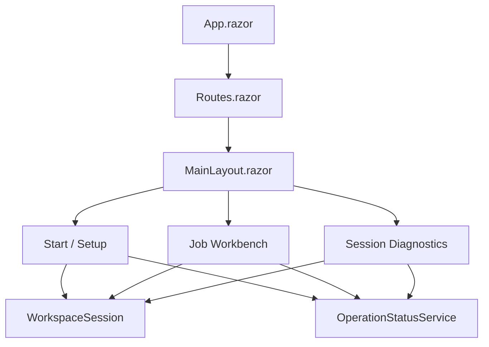
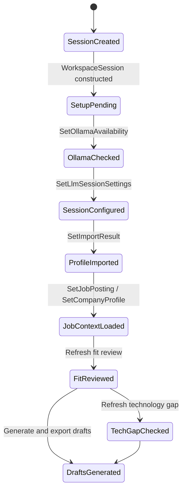
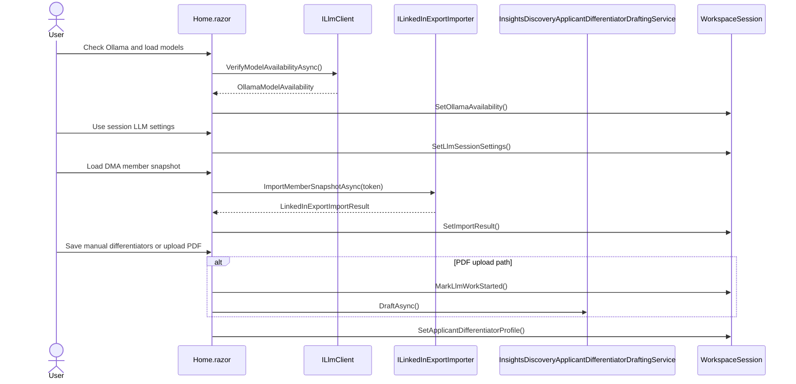
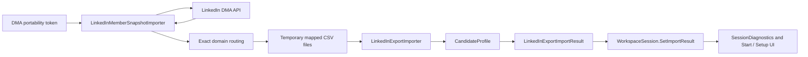
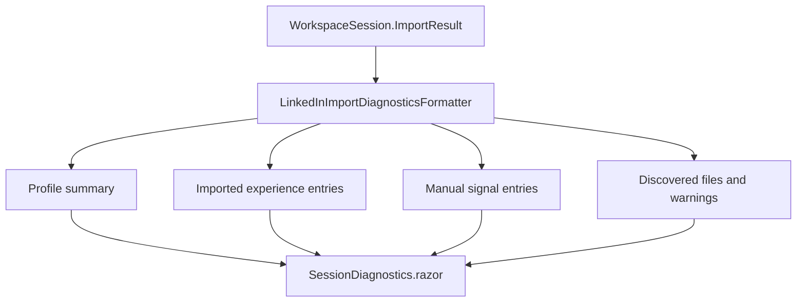
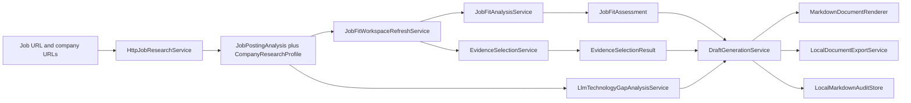
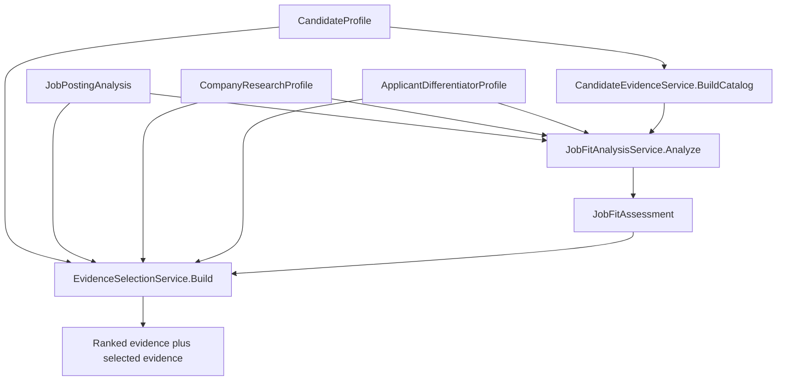
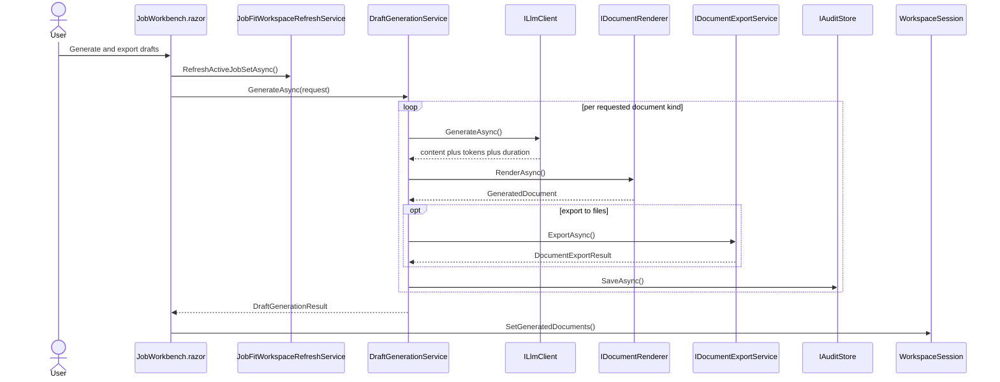
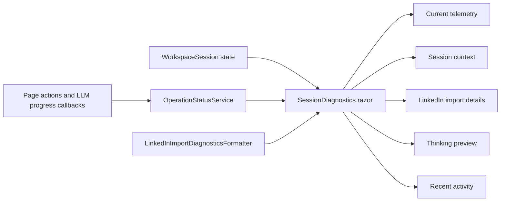

# Application Flow

This document is the maintainer and contributor reference for how LI CV Writer currently works. It complements the shorter user-facing summary in [README.md](../README.md) and focuses on page boundaries, session state, service orchestration, data movement, and the split between deterministic and LLM-backed behavior.

## Purpose and scope

LI CV Writer is a local-first Blazor application that guides a user through three broad phases:

1. Establish shared session context on Start / Setup.
2. Build job-specific context in one or more job tabs in the Job Workbench.
3. Use that context to review fit, rank evidence, inspect technology gaps, and generate markdown deliverables.

This document describes the currently implemented flow only. It intentionally documents the present combined research action, the current LinkedIn DMA import pipeline, the diagnostics page as it exists today, and the current state invalidation rules.

## 1. Top-level system map

The application is split across the Web, Application, Infrastructure, and Core projects. The Web project owns the interactive flow and state container, the Application project owns deterministic analysis and ranking, the Infrastructure project owns integrations and LLM-backed services, and the Core project holds the main domain records.

### Primary files and responsibilities

| Concern | Primary files | What they do |
| --- | --- | --- |
| App bootstrap | [Program.cs](../src/LiCvWriter.Web/Program.cs), [App.razor](../src/LiCvWriter.Web/Components/App.razor), [Routes.razor](../src/LiCvWriter.Web/Components/Routes.razor) | DI registration, routing, Razor component startup, HTTP client configuration |
| Shell and navigation | [MainLayout.razor](../src/LiCvWriter.Web/Components/Layout/MainLayout.razor), [NavMenu.razor](../src/LiCvWriter.Web/Components/Layout/NavMenu.razor) | Workspace sidebar, top-level links, shared layout |
| Shared session state | [WorkspaceSession.cs](../src/LiCvWriter.Web/Services/WorkspaceSession.cs), [WorkspaceRecoveryStore.cs](../src/LiCvWriter.Web/Services/WorkspaceRecoveryStore.cs) | Global session state, per-job tab state, recovery persistence |
| Setup flow | [Home.razor](../src/LiCvWriter.Web/Components/Pages/Home.razor) | Ollama verification, session model selection, DMA import, differentiators |
| Workbench flow | [JobWorkbench.razor](../src/LiCvWriter.Web/Components/Pages/Workspace/JobWorkbench.razor) | Job research, fit review, evidence selection, technology gap, generation/export |
| LinkedIn import | [LinkedInMemberSnapshotImporter.cs](../src/LiCvWriter.Infrastructure/LinkedIn/LinkedInMemberSnapshotImporter.cs), [LinkedInExportImporter.cs](../src/LiCvWriter.Infrastructure/LinkedIn/LinkedInExportImporter.cs) | DMA fetch, domain routing, CSV staging, profile assembly |
| Deterministic scoring | [JobFitWorkspaceRefreshService.cs](../src/LiCvWriter.Web/Services/JobFitWorkspaceRefreshService.cs), [JobFitAnalysisService.cs](../src/LiCvWriter.Application/Services/JobFitAnalysisService.cs), [EvidenceSelectionService.cs](../src/LiCvWriter.Application/Services/EvidenceSelectionService.cs) | Fit assessment and evidence ranking |
| LLM-backed research and generation | [HttpJobResearchService.cs](../src/LiCvWriter.Infrastructure/Research/HttpJobResearchService.cs), [LlmTechnologyGapAnalysisService.cs](../src/LiCvWriter.Web/Services/LlmTechnologyGapAnalysisService.cs), [DraftGenerationService.cs](../src/LiCvWriter.Infrastructure/Workflows/DraftGenerationService.cs) | Structured parsing, technology gap analysis, draft generation |
| Diagnostics | [SessionDiagnostics.razor](../src/LiCvWriter.Web/Components/Pages/Diagnostics/SessionDiagnostics.razor), [LinkedInImportDiagnosticsFormatter.cs](../src/LiCvWriter.Infrastructure/LinkedIn/LinkedInImportDiagnosticsFormatter.cs), [OperationStatusService.cs](../src/LiCvWriter.Web/Services/OperationStatusService.cs) | Live telemetry, import diagnostics, current session inspection |

### App shell and page flow

## 2. Session state and recovery

`WorkspaceSession` is the main in-memory state container. It combines session-global state with per-job-tab state and raises a `Changed` event so the pages can rerender when the underlying state changes.

### State ownership

| Scope | Stored in | Examples |
| --- | --- | --- |
| Session-global | `WorkspaceSession` | `CandidateProfile`, `ImportResult`, `ApplicantDifferentiatorProfile`, `OllamaAvailability`, `SelectedLlmModel`, `SelectedThinkingLevel`, `HasStartedLlmWork` |
| Job-tab-local | `JobSetSessionState` inside `WorkspaceSession.JobSets` | `JobPosting`, `CompanyProfile`, `JobFitAssessment`, `EvidenceSelection`, `TechnologyGapAssessment`, `GeneratedDocuments`, `Exports`, `SelectedEvidenceIds`, `OutputLanguage` |
| Recovery persistence | `WorkspaceRecoveryStore` and `WorkspaceRecoverySnapshot` | active tab selection, job-tab inputs, applicant differentiators, selected evidence IDs, output folders, some recovered job context |

### Workspace lifecycle

### State invalidation rules

These rules matter because many flows intentionally clear downstream results to prevent stale outputs.

| Action | Scope | State impact |
| --- | --- | --- |
| `SetImportResult()` | All job tabs | Replaces `CandidateProfile`, stores `ImportResult`, clears generated artifacts for all tabs, clears all job-fit assessments, technology-gap assessments, and evidence selections |
| `SetApplicantDifferentiatorProfile()` | All job tabs | Stores the differentiator profile, clears all job-fit assessments, clears evidence selections but preserves selected evidence IDs so they can be reapplied on reranking |
| `SetJobPosting()` | Active job tab only | Stores the parsed job posting, resets fit review, technology gap, selected evidence IDs, evidence selection, progress state, generated docs, and exports |
| `SetCompanyProfile()` | Active job tab only | Stores the company profile and resets fit review, technology gap, evidence selection, progress state, generated docs, and exports |
| `SetOllamaAvailability()` | Session-global | Updates model availability and clears `IsLlmSessionConfigured` if the previously selected model is not available in the current Ollama response |
| `MarkLlmWorkStarted()` | Session-global | Sets `HasStartedLlmWork`, which prevents later edits to session model settings |
| `SetGeneratedDocuments()` | Active job tab only | Marks the tab done and stores the generated documents and file exports |

## 3. Start / Setup flow

Start / Setup is implemented in [Home.razor](../src/LiCvWriter.Web/Components/Pages/Home.razor). It combines three user-facing setup steps with shared status cards and readiness messaging.

### What happens on this page

1. The user checks the local Ollama service and loads available models.
2. The user chooses a session model and a thinking level.
3. The user imports the LinkedIn DMA member snapshot with a portability token.
4. The user optionally captures or drafts applicant differentiators.
5. The page surfaces what is still blocking the move into Job Workbench.

### Start / Setup sequence

### Step 1: Ollama and session model

The page starts by checking Ollama through `ILlmClient.VerifyModelAvailabilityAsync()`. The returned `OllamaModelAvailability` determines which models the user can select. The model and thinking level are session-scoped, not persisted as a user secret, and remain editable only until LLM-backed work begins.

The Step 1 panel is now collapsible. After a successful `UseSessionLlmSettingsAsync()` call, the detailed controls collapse into a compact shell. Clicking `CheckOllamaAsync()` expands them again so the user can refresh availability and revise the model choice if the session is still editable.

### Step 2: LinkedIn DMA import

The second setup card is the profile bootstrapper. It takes a runtime DMA portability token, calls into the LinkedIn importer pipeline, updates `WorkspaceSession.ImportResult`, and makes the imported `CandidateProfile` available to the rest of the app.

### Step 3: Applicant differentiators

The third card captures optional differentiator context. These notes are session-global and can influence later fit review and generation. The manual-input path is deterministic and immediate. The PDF path is LLM-backed and locks LLM settings because it marks LLM-backed work as started.

## 4. LinkedIn DMA import and diagnostics

The LinkedIn DMA import is a two-stage pipeline: fetch and route DMA snapshot domains, then parse the staged CSV-like export surface into the application profile model.

### Domain buckets

| Bucket | Domains | Destination |
| --- | --- | --- |
| First-class typed import | `PROFILE`, `POSITIONS`, `EDUCATION`, `SKILLS`, `CERTIFICATIONS`, `PROJECTS`, `RECOMMENDATIONS` | Typed `CandidateProfile` fields |
| Enrichment import | `VOLUNTEERING_EXPERIENCES`, `LANGUAGES`, `PUBLICATIONS`, `PATENTS`, `HONORS`, `COURSES`, `ORGANIZATIONS` | `CandidateProfile.ManualSignals` |
| Explicitly ignored examples | `ARTICLES`, `LEARNING`, `WHATSAPP_NUMBERS`, `PROFILE_SUMMARY`, `PHONE_NUMBERS`, `EMAIL_ADDRESSES` | Not written to files, not imported, not surfaced as unsupported-domain warnings |

### LinkedIn import pipeline

### Mapping details

`LinkedInMemberSnapshotImporter` is responsible for paging through the API, applying the exact domain registry, and writing the temporary export-root files. `LinkedInExportImporter` then parses those files and maps them into `CandidateProfile` collections. Enrichment domains become multiline note summaries in `ManualSignals`, not new first-class typed collections.

That separation is deliberate. Typed collections such as `Experience`, `Education`, `Skills`, and `Certifications` feed later ranking and document wording more strongly than enrichment notes. Keeping enrichment domains in `ManualSignals` lets the app preserve extra context without overloading narrower concepts.

### Diagnostics rendering

The diagnostics page reads `Workspace.ImportResult` and formats it through `LinkedInImportDiagnosticsFormatter`. The formatter builds a display-ready snapshot with overview counts, discovered files, imported experience previews, enrichment notes, and warnings.

## 5. Job Workbench flow

The Job Workbench is the main job-specific orchestration surface. It is implemented in [JobWorkbench.razor](../src/LiCvWriter.Web/Components/Pages/Workspace/JobWorkbench.razor) and works on top of `WorkspaceSession.ActiveJobSet`.

### What each job tab owns

Each job tab carries its own:

- target job URL
- company-context URLs
- parsed `JobPostingAnalysis`
- parsed `CompanyResearchProfile`
- `JobFitAssessment`
- `EvidenceSelectionResult`
- `TechnologyGapAssessment`
- output language
- generated markdown documents and exported file paths

### End-to-end workbench pipeline

### Research

The research panel now uses one combined action: `AnalyzeAndBuildContextAsync()`. It validates the job URL and company-context URLs up front, persists the input fields, marks LLM work as started, and then runs two sequential operations:

1. `ExecuteJobAnalysisAsync()` via `IJobResearchService.AnalyzeAsync()`
2. `ExecuteCompanyContextAsync()` via `IJobResearchService.BuildCompanyProfileAsync()`

The flow is intentionally sequential rather than parallel. Both stages mutate shared page state, shared operation telemetry, and the active job set. If job analysis fails, company-context building does not run. If job analysis succeeds and company-context building fails, the job snapshot remains updated and the company-context failure is reported separately.

### Fit review and evidence ranking

Fit review and evidence ranking are refreshed through `JobFitWorkspaceRefreshService`. That service builds a deterministic fit assessment and then immediately builds a ranked evidence selection from the current profile and job context.

`JobFitAnalysisService` uses grounded `JobContextSignal` data when available and falls back to static signal extraction only when richer source-backed context is missing. `EvidenceSelectionService` then ranks evidence items by type, requirement alignment, differentiator alignment, recommendation strength, and broader context matches.

### Technology gap analysis

The technology gap check is currently LLM-backed, with deterministic fallback behavior available through the analyzer layer if structured parsing fails. The service looks at the candidate profile, the parsed job signals, and any company signals to surface likely underrepresented technologies for the active job tab.

### Draft generation and export

Draft generation is orchestrated by `DraftGenerationService`. The user chooses which document kinds to generate and the output language, and the workbench sends a `DraftGenerationRequest` that includes candidate data, job context, company context, fit review, selected evidence, applicant differentiators, and extra instructions.

The renderer stage remains separate from the LLM call so markdown shaping, metadata, and output-path handling stay explicit. The export stage writes local markdown files, and the audit stage records generation metadata such as model, thinking level, document kind, fit recommendation, selected evidence count, and token counts.

## 6. Telemetry and diagnostics

`OperationStatusService` is the global activity and LLM telemetry feed. Pages call into it through `RunAsync()` and through LLM progress callbacks, and `SessionDiagnostics.razor` surfaces the most relevant current telemetry plus recent activity.

### Diagnostics flow

The diagnostics page is intentionally where the verbose details live. The default setup and workbench pages keep the main workflow readable, while the diagnostics page exposes live LLM progress, token counts, import warnings, and the current thinking preview when available.

## 7. Deterministic vs. LLM-backed behavior

This split is important for contributors because it explains what depends on the current session model and what does not.

| Concern | Primary path | Depends on selected session model? | Notes |
| --- | --- | --- | --- |
| Ollama verification | `ILlmClient.VerifyModelAvailabilityAsync()` | No | Checks service reachability and available models |
| Job parsing | `HttpJobResearchService.AnalyzeAsync()` | Yes | LLM-backed structured parsing |
| Company parsing | `HttpJobResearchService.BuildCompanyProfileAsync()` | Yes | LLM-backed structured parsing |
| Insights PDF drafting | `InsightsDiscoveryApplicantDifferentiatorDraftingService.DraftAsync()` | Yes | LLM-backed extraction summary and field drafting |
| Fit review | `JobFitAnalysisService.Analyze()` | No | Deterministic once profile and job context exist |
| Evidence ranking | `EvidenceSelectionService.Build()` | No | Deterministic once profile and job context exist |
| Technology gap | `LlmTechnologyGapAnalysisService.AnalyzeAsync()` | Yes, primary path | Deterministic fallback exists in the analyzer layer |
| Draft generation | `DraftGenerationService.GenerateAsync()` | Yes | Uses selected session model and thinking level |
| Diagnostics rendering | `SessionDiagnostics.razor` and formatter layer | No | Reads stored state and telemetry |

## 8. Current implementation boundaries

The current documentation should be maintained against these live constraints:

- Start / Setup is the entry point for session-wide LLM and profile context.
- The user can choose any locally available Ollama model surfaced by the runtime check.
- The Job Workbench research action runs job parsing and company-context building from one button, but it executes those stages sequentially.
- LinkedIn DMA import is the supported import path documented in the UI and README.
- LinkedIn enrichment domains currently preserved as notes are `VOLUNTEERING_EXPERIENCES`, `LANGUAGES`, `PUBLICATIONS`, `PATENTS`, `HONORS`, `COURSES`, and `ORGANIZATIONS`.
- `ARTICLES`, `LEARNING`, and `WHATSAPP_NUMBERS` are explicitly ignored in the DMA routing layer.
- Fit review and evidence ranking are deterministic after context is loaded.
- Session LLM settings become non-editable after LLM-backed work has started.
- The diagnostics page is the main place for deeper telemetry and import inspection.

## Read together with

- User-facing product summary: [README.md](../README.md)
- Start / Setup implementation: [Home.razor](../src/LiCvWriter.Web/Components/Pages/Home.razor)
- Job Workbench implementation: [JobWorkbench.razor](../src/LiCvWriter.Web/Components/Pages/Workspace/JobWorkbench.razor)
- Session state container: [WorkspaceSession.cs](../src/LiCvWriter.Web/Services/WorkspaceSession.cs)
- LinkedIn DMA import pipeline: [LinkedInMemberSnapshotImporter.cs](../src/LiCvWriter.Infrastructure/LinkedIn/LinkedInMemberSnapshotImporter.cs) and [LinkedInExportImporter.cs](../src/LiCvWriter.Infrastructure/LinkedIn/LinkedInExportImporter.cs)