# LI CV Writer — Technical Reference

This document is the maintainer, contributor, and evaluator reference for how LI CV Writer works. It covers architecture, data flows, session state, every major pipeline, and the design decisions behind deterministic and LLM-backed behavior.

For the user-facing summary, see [README.md](../README.md).

---

## Table of Contents

1. [Architecture Overview](#1-architecture-overview)
2. [System Map](#2-system-map)
3. [Domain Records](#3-domain-records)
4. [Session State and Recovery](#4-session-state-and-recovery)
5. [Start / Setup Flow](#5-start--setup-flow)
6. [LinkedIn DMA Import](#6-linkedin-dma-import)
7. [LinkedIn CSV Export Import](#7-linkedin-csv-export-import)
8. [Profile Merge](#8-profile-merge)
9. [Job Workbench Flow](#9-job-workbench-flow)
10. [Fit Review and Evidence Ranking](#10-fit-review-and-evidence-ranking)
11. [Technology Gap Analysis](#11-technology-gap-analysis)
12. [Refresh-All Orchestration](#12-refresh-all-orchestration)
13. [Document Generation Pipeline](#13-document-generation-pipeline)
14. [Markdown Rendering](#14-markdown-rendering)
15. [Template-Based Word Export](#15-template-based-word-export)
16. [LLM Prompt Architecture](#16-llm-prompt-architecture)
17. [Streaming Transport and Repetition Detection](#17-streaming-transport-and-repetition-detection)
18. [Telemetry and Diagnostics](#18-telemetry-and-diagnostics)
19. [Deterministic vs. LLM-Backed Behavior](#19-deterministic-vs-llm-backed-behavior)
20. [Implementation Boundaries](#20-implementation-boundaries)

---

## 1. Architecture Overview

The solution follows a Domain-Driven Design layering where each project has a single responsibility direction and dependencies flow inward.

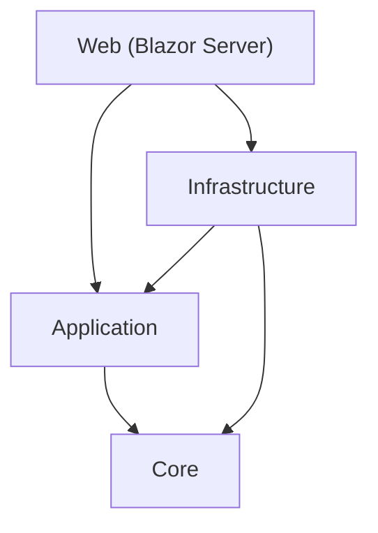

### Project Responsibilities

| Project | Responsibility |
| --- | --- |
| **LiCvWriter.Core** | Domain records: profiles, jobs, documents, auditing. No behavior, no dependencies. |
| **LiCvWriter.Application** | Abstractions (interfaces), deterministic services (fit scoring, evidence ranking, profile merging), models, and options. References Core only. |
| **LiCvWriter.Infrastructure** | Integrations: Ollama LLM client, LinkedIn DMA import, HTTP research, document rendering, Word/Markdown export, audit storage, workspace recovery. References Application and Core. |
| **LiCvWriter.Web** | Blazor Server host: pages, session state, DI registration, operation status. References all layers. |
| **LiCvWriter.Tests** | xUnit test suite (206 tests) covering application services, infrastructure services, and web components. |

### Primary Files

| Concern | Primary files | Purpose |
| --- | --- | --- |
| Bootstrap | [Program.cs](../src/LiCvWriter.Web/Program.cs), [App.razor](../src/LiCvWriter.Web/Components/App.razor), [Routes.razor](../src/LiCvWriter.Web/Components/Routes.razor) | DI, routing, HTTP client configuration |
| Shell | [MainLayout.razor](../src/LiCvWriter.Web/Components/Layout/MainLayout.razor), [NavMenu.razor](../src/LiCvWriter.Web/Components/Layout/NavMenu.razor) | Floating navigation, dual CRT monitors, completed-activity sidebar |
| Streaming transport | [Program.cs](../src/LiCvWriter.Web/Program.cs), [LlmOperationBroker.cs](../src/LiCvWriter.Web/Services/LlmOperationBroker.cs), [llm-stream.js](../src/LiCvWriter.Web/wwwroot/llm-stream.js) | Start/status/events/cancel endpoints, per-jobset operation broker, browser `EventSource` bridge |
| Session state | [WorkspaceSession.cs](../src/LiCvWriter.Web/Services/WorkspaceSession.cs), [WorkspaceRecoveryStore.cs](../src/LiCvWriter.Web/Services/WorkspaceRecoveryStore.cs) | In-memory state container, recovery persistence |
| Setup flow | [Home.razor](../src/LiCvWriter.Web/Components/Pages/Home.razor) | Ollama check, model selection, DMA import, differentiators |
| Workbench flow | [JobWorkbench.razor](../src/LiCvWriter.Web/Components/Pages/Workspace/JobWorkbench.razor) | Brokered job research, fit review, evidence, technology gap, refresh-all, generation |
| LinkedIn import | [LinkedInMemberSnapshotImporter.cs](../src/LiCvWriter.Infrastructure/LinkedIn/LinkedInMemberSnapshotImporter.cs), [LinkedInExportImporter.cs](../src/LiCvWriter.Infrastructure/LinkedIn/LinkedInExportImporter.cs) | DMA fetch, domain routing, CSV staging, profile assembly |
| Deterministic scoring | [JobFitAnalysisService.cs](../src/LiCvWriter.Application/Services/JobFitAnalysisService.cs), [EvidenceSelectionService.cs](../src/LiCvWriter.Application/Services/EvidenceSelectionService.cs), [CandidateEvidenceService.cs](../src/LiCvWriter.Application/Services/CandidateEvidenceService.cs) | Fit assessment, evidence ranking, evidence cataloguing |
| LLM research | [HttpJobResearchService.cs](../src/LiCvWriter.Infrastructure/Research/HttpJobResearchService.cs), [LlmTechnologyGapAnalysisService.cs](../src/LiCvWriter.Web/Services/LlmTechnologyGapAnalysisService.cs), [LlmFitEnhancementService.cs](../src/LiCvWriter.Infrastructure/Workflows/LlmFitEnhancementService.cs) | Structured job/company parsing, technology gap analysis, semantic fit enhancement |
| Generation | [DraftGenerationService.cs](../src/LiCvWriter.Infrastructure/Workflows/DraftGenerationService.cs) | Orchestrates LLM call → render → export → audit per document kind |
| Document rendering | [MarkdownDocumentRenderer.cs](../src/LiCvWriter.Infrastructure/Documents/MarkdownDocumentRenderer.cs) | Shapes LLM output into structured Markdown with ATS sections |
| Template export | [TemplateBasedDocumentExportService.cs](../src/LiCvWriter.Infrastructure/Documents/TemplateBasedDocumentExportService.cs), [CvMarkdownSectionExtractor.cs](../src/LiCvWriter.Infrastructure/Documents/CvMarkdownSectionExtractor.cs), [CvWordTemplateGenerator.cs](../src/LiCvWriter.Infrastructure/Documents/Templates/CvWordTemplateGenerator.cs), [TemplateContentPopulator.cs](../src/LiCvWriter.Infrastructure/Documents/Templates/TemplateContentPopulator.cs) | Template-based Word export with content controls |
| LLM client | [OllamaClient.cs](../src/LiCvWriter.Infrastructure/Llm/OllamaClient.cs) | Streaming transport, chunk aggregation, repetition detection |
| Operational status | [MainLayout.razor](../src/LiCvWriter.Web/Components/Layout/MainLayout.razor), [OperationStatusService.cs](../src/LiCvWriter.Web/Services/OperationStatusService.cs) | Sidebar telemetry feeds and recent activity |

---

## 2. System Map

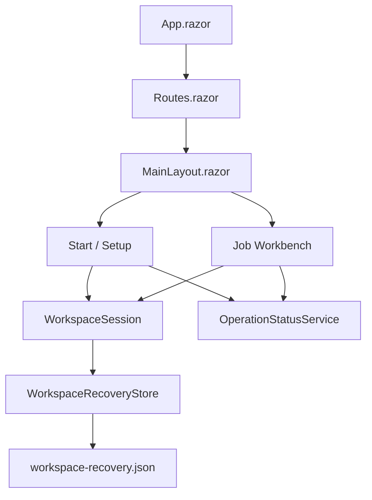

The two main pages share `WorkspaceSession` for state and `OperationStatusService` for activity telemetry. `MainLayout.razor` subscribes to `OperationStatusService` to keep the floating navigation, reasoning monitor, status monitor, and completed-activity list in sync while long-running work streams in. `WorkspaceRecoveryStore` persists the full session snapshot to disk as JSON for cross-restart recovery.

---

## 3. Domain Records

### Core/Profiles

| Record | Fields |
| --- | --- |
| `CandidateProfile` | Name, Headline, Summary, Location, Industry, PublicProfileUrl, PrimaryEmail, Experience, Education, Skills, Certifications, Projects, Recommendations, ManualSignals |
| `ExperienceEntry` | CompanyName, Title, Description, Location, Period, Highlights |
| `ProjectEntry` | Title, Description, Url, Period |
| `RecommendationEntry` | Author (PersonName), Company, JobTitle, Text, VisibilityStatus, CreatedOn |
| `CertificationEntry` | Name, Authority, Url, Period, LicenseNumber |
| `EducationEntry` | SchoolName, DegreeName, Notes, Activities, Period |
| `ApplicantDifferentiatorProfile` | WorkStyle, CommunicationStyle, LeadershipStyle, StakeholderStyle, Motivators, TargetNarrative, Watchouts, AboutApplicantBasis |
| `EvidenceSelectionResult` | RankedEvidence, SelectedEvidence |

### Core/Jobs

| Record | Fields |
| --- | --- |
| `JobPostingAnalysis` | SourceUrl, RoleTitle, CompanyName, Summary, MustHaveThemes, NiceToHaveThemes, CulturalSignals, Signals |
| `CompanyResearchProfile` | Name, Summary, SourceUrls, GuidingPrinciples, CulturalSignals, Differentiators, Signals |
| `JobFitAssessment` | OverallScore, Recommendation, Requirements, Strengths, Gaps |
| `TechnologyGapAssessment` | DetectedTechnologies, PossiblyUnderrepresentedTechnologies |

### Core/Documents

| Record | Fields |
| --- | --- |
| `DocumentKind` | Cv, CoverLetter, ProfileSummary, Recommendations, InterviewNotes |
| `GeneratedDocument` | Kind, Title, Markdown, PlainText, GeneratedAtUtc, OutputPath, LlmDuration, PromptTokens, CompletionTokens, Model |

---

## 4. Session State and Recovery

`WorkspaceSession` is the main in-memory state container. It splits into session-global state and per-jobset state and raises a `Changed` event for page rerendering.

### State Ownership

| Scope | Container | Examples |
| --- | --- | --- |
| Session-global | `WorkspaceSession` | `CandidateProfile`, `ApplicantDifferentiatorProfile`, `OllamaAvailability`, `SelectedLlmModel`, `SelectedThinkingLevel`, `HasStartedLlmWork`, `LinkedInAuthorizationStatus` |
| Jobset-local | `JobSetSessionState` | `JobPosting`, `CompanyProfile`, `JobFitAssessment`, `EvidenceSelection`, `TechnologyGapAssessment`, `GeneratedDocuments`, `Exports`, `SelectedEvidenceIds`, `OutputLanguage`, `InputLanguage`, `AdditionalInstructions` |
| Recovery | `WorkspaceRecoveryStore` | Job sets, jobset inputs, applicant differentiators, selected evidence IDs, output folders, fit review fingerprints |

### Workspace Lifecycle

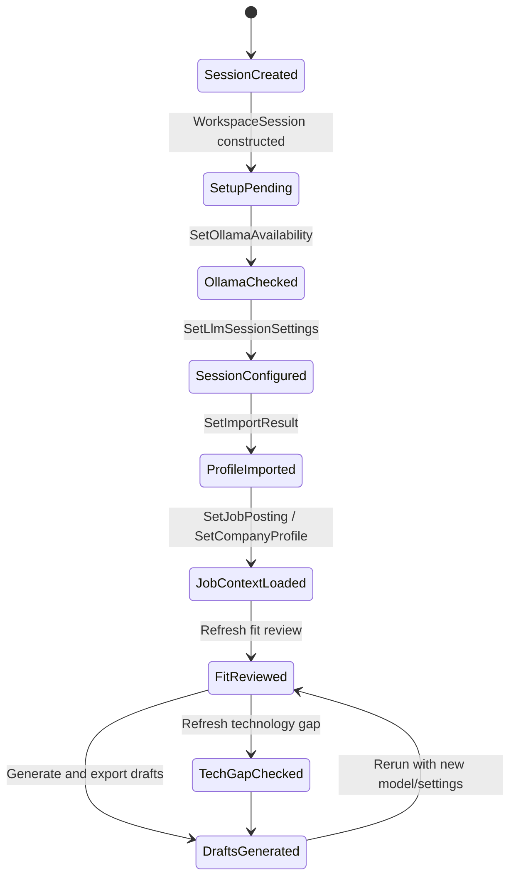

### State Invalidation Rules

These rules prevent stale outputs by clearing downstream results when upstream inputs change.

| Action | Scope | Impact |
| --- | --- | --- |
| `SetImportResult()` | All jobsets | Replaces `CandidateProfile`, stores `ImportResult`, clears generated artifacts, fit assessments, technology gaps, and evidence selections for all jobsets |
| `SetApplicantDifferentiatorProfile()` | All jobsets | Stores differentiator profile, clears all fit assessments, clears evidence selections (preserves selected IDs for reranking) |
| `SetJobPosting()` | Specific jobset | Replaces job posting, resets fit review, technology gap, evidence, progress, generated docs, exports |
| `SetCompanyProfile()` | Specific jobset | Replaces company profile, resets fit review, technology gap, evidence, progress, generated docs, exports |
| `SetOllamaAvailability()` | Session-global | Updates model availability, clears `IsLlmSessionConfigured` if selected model is no longer available |
| `MarkLlmWorkStarted()` | Session-global | Records that the session has performed LLM-backed work so the setup UI can warn that later model/thinking changes affect only future operations |
| `SetGeneratedDocuments()` | Specific jobset | Marks tab done, stores generated documents and file exports |

### Workspace Recovery

Session state survives application restarts via `WorkspaceRecoveryStore`.

**Storage**: `{WorkingRoot}/workspace-recovery.json` — indented JSON, case-insensitive deserialization, thread-safe via `lock(gate)`.

**Snapshot structure:**

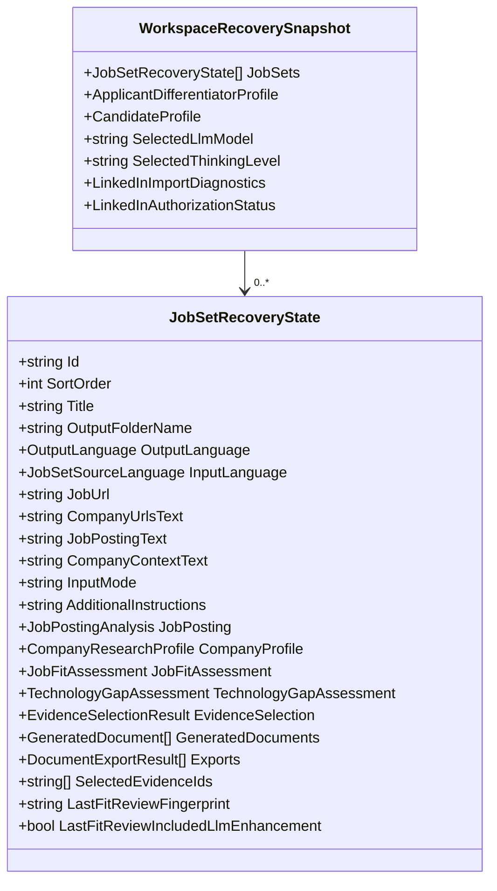

**Operations:**
- `Load()` — Deserializes JSON on startup, returns null if file missing or parse fails
- `Save()` — Serializes snapshot to JSON, creates directories as needed, silently catches exceptions (recovery metadata never blocks UI)

---

## 5. Start / Setup Flow

Implemented in [Home.razor](../src/LiCvWriter.Web/Components/Pages/Home.razor). Combines three setup steps with shared status messaging.

### Sequence

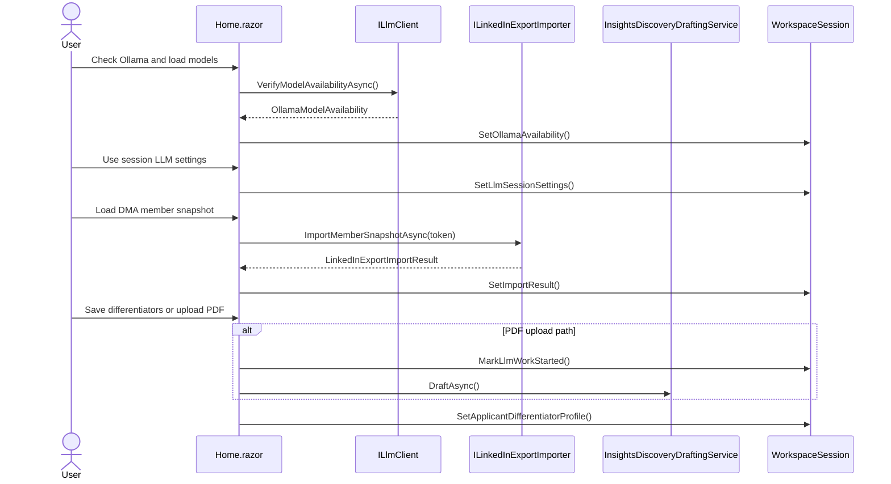

### Step 1: Ollama and Session Model

The page checks Ollama through `ILlmClient.VerifyModelAvailabilityAsync()`. The returned `OllamaModelAvailability` determines which models the user can select. The model and thinking level are session-scoped and remain editable throughout the session. After LLM-backed work begins, the setup page warns that later changes apply to future operations only, so completed analyses or generated drafts need to be rerun if the user wants them refreshed with the new settings.

The panel is collapsible — after `UseSessionLlmSettingsAsync()`, the controls collapse into a compact shell. Clicking `CheckOllamaAsync()` expands them again and refreshes model availability.

### Step 2: LinkedIn DMA Import

Takes a runtime DMA portability token, calls the LinkedIn importer pipeline, updates `WorkspaceSession.ImportResult`, and makes the `CandidateProfile` available to all downstream flows. Alternatively, a CSV export root path can be used (see [§7](#7-linkedin-csv-export-import)).

### Step 3: Applicant Differentiators

Optional session-global notes (work style, communication, leadership, stakeholders, motivators, target narrative, watchouts, proof points). The manual path is immediate. The PDF path sends extracted text through the session model and calls `MarkLlmWorkStarted()`, which records that the session has used LLM-backed work but does not prevent later model/thinking changes.

---

## 6. LinkedIn DMA Import

The import is a two-stage pipeline: fetch and route DMA snapshot domains, then parse staged CSV exports into the application profile model.

### Domain Buckets

| Bucket | Domains | Destination |
| --- | --- | --- |
| First-class typed | `PROFILE`, `POSITIONS`, `EDUCATION`, `SKILLS`, `CERTIFICATIONS`, `PROJECTS`, `RECOMMENDATIONS` | Typed `CandidateProfile` fields (Experience, Education, Skills, etc.) |
| Enrichment | `VOLUNTEERING_EXPERIENCES`, `LANGUAGES`, `PUBLICATIONS`, `PATENTS`, `HONORS`, `COURSES`, `ORGANIZATIONS` | `CandidateProfile.ManualSignals` (note-like summaries) |
| Explicitly ignored | `ARTICLES`, `LEARNING`, `WHATSAPP_NUMBERS`, `PROFILE_SUMMARY`, `PHONE_NUMBERS`, `EMAIL_ADDRESSES` | Not imported, not written, no diagnostics warnings |

### Import Pipeline

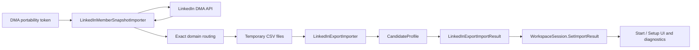

`LinkedInMemberSnapshotImporter` pages through the API, applies the domain registry, and writes temporary export-root files. `LinkedInExportImporter` parses those files and maps them into `CandidateProfile` collections.

The typed/enrichment split is deliberate. Typed collections (Experience, Education, Skills, Certifications, Projects, Recommendations) feed ranking and document generation more strongly than enrichment notes. Enrichment domains in `ManualSignals` preserve extra context without overloading narrower concepts.

### Import Diagnostics Data

`WorkspaceSession.SetImportResult` keeps the latest `LinkedInExportImportResult` and its formatted diagnostics snapshot available to the local session. The dedicated Session Diagnostics page was removed; future diagnostics should remain non-routed developer internals unless an explicit local-only UI need returns.

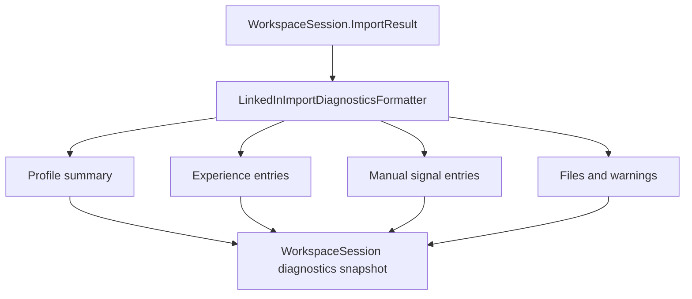

---

## 7. LinkedIn CSV Export Import

An alternative import path uses a LinkedIn CSV data export directory.

### Supported Files

| CSV File | Maps To |
| --- | --- |
| `Profile.csv` | Candidate name, headline, summary, industry, location |
| `Positions.csv` | Experience entries (company, title, description, period) |
| `Education.csv` | Education entries (school, degree, field, dates) |
| `Skills.csv` | Skill names with proficiency and endorsement counts |
| `Certifications.csv` | Certification entries (name, authority, URL, period) |
| `Projects.csv` | Project entries (title, description, URL, period) |
| `Recommendations.csv` | Recommendation entries (author, company, title, text) |
| `VolunteeringExperiences.csv` | ManualSignals (`volunteer_<index>`) |
| `Languages.csv` | ManualSignals (`language_<index>`) |
| `Publications.csv` | ManualSignals (`publication_<index>`) |
| `Patents.csv` | ManualSignals (`patent_<index>`) |
| `Honors.csv` | ManualSignals (`honor_<index>`) |
| `Courses.csv` | ManualSignals (`course_<index>`) |
| `Organizations.csv` | ManualSignals (`organization_<index>`) |

**Processing**: Uses `SimpleCsvParser` (RFC 4180 compliant) and `LinkedInPartialDateParser` for flexible date parsing (month-year, year-only formats). Missing files produce warnings but do not block the import.

---

## 8. Profile Merge

`CandidateProfileMergeService` provides two merge strategies for combining profile data from different sources.

### Strategy 1: CSV-Preferred Merge

`Merge(csvProfile, liveProfile?, manualSignals?)` — used when importing CSV data that may be supplemented by live profile data.

- Base: `csvProfile`
- Prefers `liveProfile` for scalar fields (headline, summary, industry, location, email, URL)
- Merges collections by deduplication key:

| Collection | Dedup Key |
| --- | --- |
| Experience | `CompanyName\|Title\|Period` |
| Education | `SchoolName\|DegreeName\|Period` |
| Skills | `Name` |
| Certifications | `Name` |
| Projects | `Title` |
| Recommendations | `Author\|Company\|CreatedOn` |

- Merges manual signals (CSV wins, can be overridden by explicit `manualSignals` parameter)

### Strategy 2: Primary-Preferred Merge

`MergePreferPrimary(primaryProfile, fallbackProfile?, manualSignals?)` — used when live profile is the main source with fallback data for gaps.

- Base: `primaryProfile`
- Falls back to `fallbackProfile` for missing data
- Collections preserve order (primary first, then fallback), deduplicated by key

---

## 9. Job Workbench Flow

Implemented in [JobWorkbench.razor](../src/LiCvWriter.Web/Components/Pages/Workspace/JobWorkbench.razor). Each jobset is independent and carries its own state through `JobSetSessionState`.

### Brokered Operations

The workbench supports five brokered LLM operations, all streaming progress via SSE:

| Operation | Broker Method | Trigger | Preconditions |
| --- | --- | --- | --- |
| **Job Context Analysis** | `StartJobContextAnalysis()` | "Analyze job and build company context" | LLM ready, job URL or text input |
| **Fit Review** | `StartFitReviewAnalysis()` | "Refresh fit review" | Profile loaded, job analysis complete |
| **Technology Gap** | `StartTechnologyGapAnalysis()` | "Refresh technology gap check" | Profile loaded, job analysis complete |
| **Refresh All** | `StartRefreshAllAnalysis()` | "Refresh all elements" | LLM ready (optionally: profile loaded) |
| **Draft Generation** | `StartDraftGeneration()` | "Generate and export drafts" | Differentiators defined, evidence selected, job analysis complete |

### Brokered Streaming Transport

The page starts a brokered operation through Minimal API endpoints, receives an operation id plus snapshot/events/cancel URLs, and subscribes to `/api/llm/operations/{operationId}/events` via `EventSource` in [llm-stream.js](../src/LiCvWriter.Web/wwwroot/llm-stream.js).

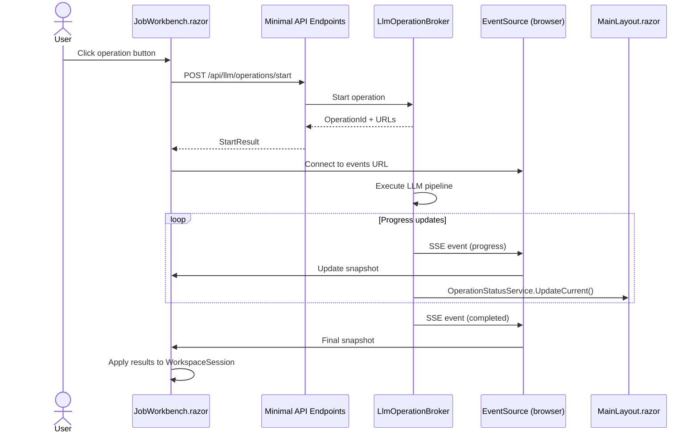

`LlmOperationBroker` enforces one active LLM operation per jobset, updates `WorkspaceSession` / `OperationStatusService`, and publishes SSE events.

### End-to-End Pipeline

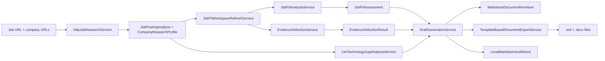

### Research

The workbench starts job-context analysis through the broker, then streams updates back into the page and shared sidebar. Inside the operation, the broker validates inputs, persists input fields, marks LLM work as started, then runs two sequential steps:

1. `ExecuteJobAnalysisAsync()` → `IJobResearchService.AnalyzeAsync()` — fetches and strips HTML from the job URL, sends to LLM for structured parsing, returns `JobPostingAnalysis`
2. `ExecuteCompanyContextAsync()` → `IJobResearchService.BuildCompanyProfileAsync()` — fetches all company-context URLs, sends to LLM, returns `CompanyResearchProfile`

Sequential execution is deliberate: both stages mutate shared page state and telemetry. If job analysis fails, company-context building does not run.

### Input Modes

The workbench supports two input modes:

- **URL mode** — job posting URL + optional company context URLs; content fetched and stripped at runtime
- **Text mode** — pasted job posting text + optional company context text; no HTTP fetching

Both modes produce the same `JobPostingAnalysis` and `CompanyResearchProfile` outputs via the same LLM parsing pipeline.

### Output Language

Each job set has an independent `OutputLanguage` setting (English or Danish). This controls:
- LLM prompt language instructions
- Section heading translation (e.g., "Professional Experience" → "Erhvervserfaring")
- Field label translation (e.g., "Role" → "Rolle", "Company" → "Virksomhed")
- Recommendation translation annotation

---

## 10. Fit Review and Evidence Ranking

Refreshed through `JobFitWorkspaceRefreshService`, which coordinates two deterministic services:

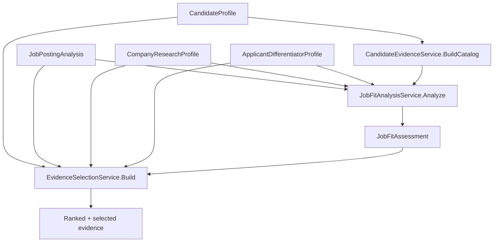

### Fit Scoring

`JobFitAnalysisService` compares the candidate profile against job requirements. Evidence is weighted by type:

| Evidence Type | Weight |
| --- | --- |
| Experience | 60 |
| Project | 55 |
| Recommendation | 50 |
| Certification | 40 |
| Summary | 20 |
| Headline | 18 |
| Note | 14 |

Requirements are categorized as must-have, nice-to-have, or cultural, and matched as strong, partial, or missing. The output is a `JobFitAssessment` with an overall score (0–100) and apply/stretch/skip recommendation.

### Optional LLM Enhancement

The broker can pass the deterministic fit output through `LlmFitEnhancementService` to add semantic evidence matching and stronger recommendation text. When enhancement is used, the workbench labels the result as LLM-enhanced while still relying on the deterministic fit pipeline as the base layer.

### Fit Review Fingerprinting

To avoid redundant recalculations, `LlmOperationBroker.BuildFitReviewFingerprint()` hashes all relevant inputs:

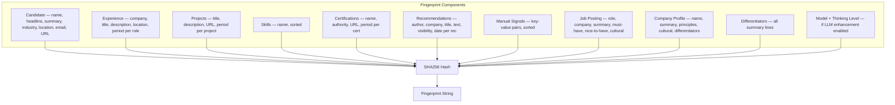

**Normalization**: Input text is split on whitespace/punctuation, rejoined with single spaces, lowercased. Blank fields are appended as `<empty>`.

**Usage**: The fingerprint is stored in `JobSetRecoveryState.LastFitReviewFingerprint` and compared against the current fingerprint to determine if a refresh is needed. This allows skipping redundant fit review runs when inputs haven't changed.

### Evidence Cataloguing

`CandidateEvidenceService.BuildCatalog()` transforms the `CandidateProfile` into a flat catalog of evidence items across seven types: Headline, Summary, Experience, Project, Recommendation, Certification, and Note (manual signals). Deduplication groups by ID and selects the richest variant.

### Evidence Ranking

`EvidenceSelectionService.Build()` multi-criteria ranks the evidence catalog:

| Criterion | Points |
| --- | --- |
| Base score by type (Experience: 24, Project: 20, Recommendation: 18, Certification: 12, Summary: 8, Headline/Note: 6) | 6–24 |
| Job requirement match (must-have: +18, nice-to-have: +10, cultural: +12) | 0–18 |
| Narrative alignment with differentiator profile | +8 |
| Third-party validation for recommendations | +6 |
| Concrete work history for experiences with source reference | +4 |
| Context term matching against job/company signals | +4 |

Returns top 30 ranked items. Evidence selection is interactive — the user can change which items are selected before generating.

---

## 11. Technology Gap Analysis

LLM-backed, with deterministic fallback. Compares candidate profile against job-detected technologies and company signals to surface possibly underrepresented technologies. Returns `TechnologyGapAssessment` with detected technologies and gap candidates.

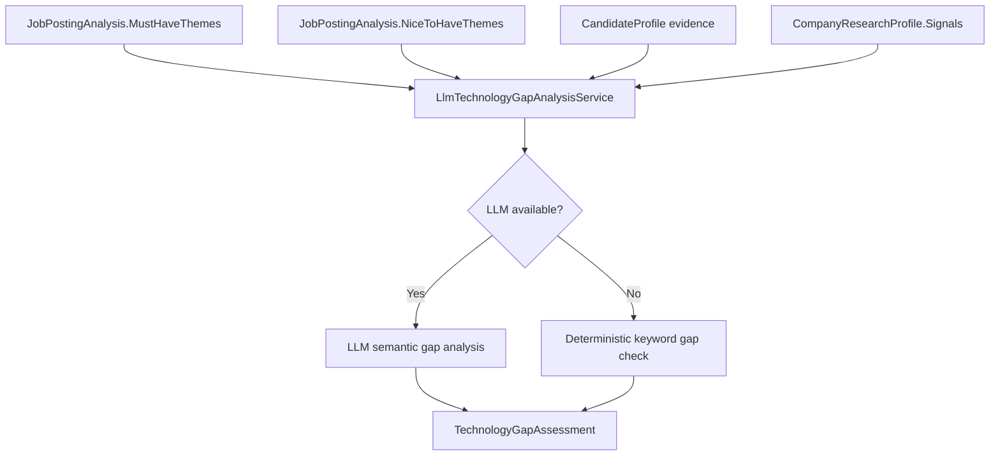

---

## 12. Refresh-All Orchestration

`LlmOperationBroker.StartRefreshAllAnalysis()` orchestrates a complete re-analysis of all job context, fit review, and technology gaps as a single streamed operation.

### Multi-Stage Flow

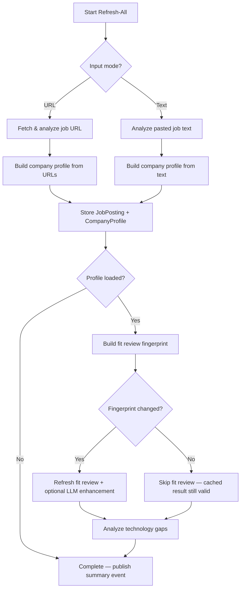

### Batch Mode

`RunAllRefreshThenDraftsAsync()` orchestrates refresh-all for all job sets, then conditional draft generation. Checkbox flags control which document kinds to generate (CV, Cover Letter, Summary, Recommendations, Interview Questions). Job sets missing profile or evidence are skipped.

---

## 13. Document Generation Pipeline

Document generation is a multi-stage pipeline orchestrated by `DraftGenerationService`: parallel LLM generation → optional refinement → Markdown rendering → file export.

### Generation Orchestration

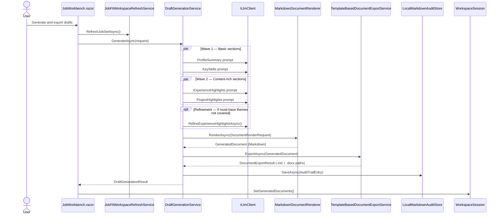

### Two-Pass Generation Strategy

The CV generation uses a wave-based approach with an optional refinement pass:

**Wave 1** (parallel): `ProfileSummary`, `KeySkills` — short, context-setting sections.

**Wave 2** (parallel): `ExperienceHighlights`, `ProjectHighlights` — longer, content-rich sections requiring deeper LLM reasoning.

**Refinement Pass** (conditional): `RefineExperienceHighlightsAsync()` fires only when:
1. The job posting has `MustHaveThemes`
2. Wave 2 produced experience highlights
3. One or more must-have themes are NOT mentioned (case-insensitive) in the first-pass experience markdown

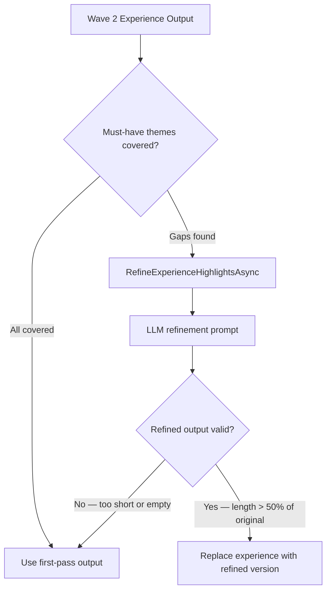

**Refinement prompt strategy:**
- System prompt: "Improve weakest bullets to cover gaps, add concrete metrics, preserve exact titles and dates"
- User prompt includes: missing themes, all themes, current experience markdown, selected evidence for grounding
- Output constraint: preserve `###` heading format, don't invent data
- Safety check: refined output must be at least 50% the length of the first pass to be accepted

---

## 14. Markdown Rendering

`MarkdownDocumentRenderer` shapes LLM-generated body text into structured Markdown with ATS-friendly section titles. The output varies by `DocumentKind`.

### CV Rendering Flow

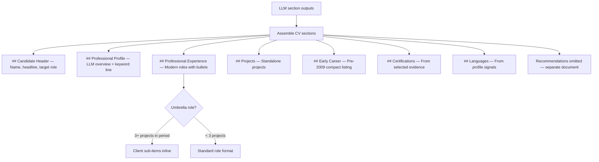

### Early Career Separation

Roles and projects are classified by end date against `EarlyCareerCutoffYear = 2009`:

| Condition | Classification |
| --- | --- |
| Role has end date and `endYear < 2009` | Early career |
| Role has no end date (ongoing) | Modern (always) |
| Role has end date and `endYear >= 2009` | Modern |

**Modern roles** get full detail: `### Title \| Company` heading, period, description paragraphs, achievement bullets.

**Early career** entries use a compact bullet format: `- **Title** \| Company (Period)` — no descriptions, no sub-headings.

### Umbrella Role Detection

A role qualifies as an "umbrella" (consulting/contracting parent) if it covers **3 or more projects** based on period containment.

**Period containment** (`PeriodContains(outer, inner)`):
- Both must have a start year
- Outer end year defaults to 9999 if ongoing
- Inner end year defaults to start year if ongoing
- Rule: `inner.start >= outer.start && inner.end <= outer.end`

**Rendering effect:**
- Covered projects appear as sub-items under the umbrella role: `- **Client: {Title}** — {Description} ({Period})`
- Standalone projects (not covered by any umbrella) render in a separate **Projects** section

### Keyword Line (ATS Optimization)

`BuildKeywordLine()` cross-references the job's `MustHaveThemes`, `NiceToHaveThemes`, and `TechnologyGapAssessment.DetectedTechnologies` against evidence tags from the selected evidence. Only terms the candidate has evidence for are included. Output: a comma-separated "Key Technologies & Competencies" line under the professional profile.

### Language Detection and Translation Annotation

Standalone recommendation documents annotate each quote with translation context when the recommendation language differs from the output language.

**Detection** uses `DetectDanish()`, a word-frequency heuristic:
- Scans all words against a 36-word `DanishMarkers` set (common Danish function words: "og", "er", "med", "har", "det", "en", "af", "til", etc.)
- Requires minimum 5 words in the text
- Threshold: ≥8% Danish marker ratio → classified as Danish

**Annotation** via `GetTranslationAnnotation()`:
- Danish text + English output → `(translated from Danish)`
- English text + Danish output → `(translated from English)`
- Same language → no annotation

### Other Document Kinds

- **Cover Letter** — focused one-page letter body generated from fit/evidence context without internal appendices
- **Profile Summary** — focused one-page profile summary generated from fit/evidence context without internal appendices
- **Recommendations** — focused recommendation brief plus deterministic recommendation quotes with attribution
- **Interview Questions** — focused one-page question set generated from fit/evidence context without internal appendices

---

## 15. Template-Based Word Export

CV documents are exported through a template-based pipeline using an embedded `.dotx` template with named content controls. Recommendations use a dedicated recommendations `.dotx` template, while cover letters, profile summaries, and interview questions use the focused application-material `.dotx` template with the same content-control population and cleanup path.

Exports follow a visible-content-only policy. DOCX remains a zipped OpenXML package internally, but LiCvWriter does not intentionally add hidden ATS XML, hidden candidate/job metadata, hidden keyword stuffing, macros, embedded objects, alt-chunks, or external relationships. ATS and AI readability improvements must be present in the visible document body: headings, clean paragraphs/lists, flattened link text, and keyword lines the recipient can inspect.

### Template Architecture

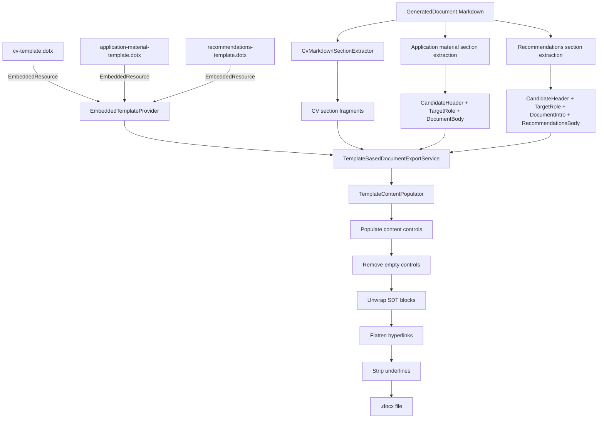

### CV Template Sections (9 Named Content Controls)

| Tag | Content | Source |
| --- | --- | --- |
| `CandidateHeader` | Name (H1), headline, target role | Extracted from assembled markdown |
| `ProfileSummary` | Professional profile overview (excludes key skills) | LLM-generated section or extraction |
| `KeySkills` | Comma-separated keyword/competency line | LLM-generated section or extraction |
| `Experience` | Professional experience (modern roles with client sub-items) | LLM-generated section or extraction |
| `Projects` | Standalone project entries | LLM-generated section or extraction |
| `Education` | Education entries | Extracted from assembled markdown |
| `Certifications` | Certification list from evidence | Extracted from assembled markdown |
| `Languages` | Language entries | Extracted from assembled markdown |
| `EarlyCareer` | Pre-2009 roles in compact format | Extracted from assembled markdown |

### Application Material Template Sections (3 Named Content Controls)

| Tag | Content | Source |
| --- | --- | --- |
| `CandidateHeader` | Name, optional headline, and contact line | Extracted from assembled markdown |
| `TargetRole` | Target role and company | Extracted from assembled markdown |
| `DocumentBody` | Cover letter, profile summary, or interview questions body | Extracted from assembled markdown |

### Recommendations Template Sections (4 Named Content Controls)

| Tag | Content | Source |
| --- | --- | --- |
| `CandidateHeader` | Name, optional headline, and contact line | Extracted from assembled markdown |
| `TargetRole` | Target role and company | Extracted from assembled markdown |
| `DocumentIntro` | Recommendation brief | Extracted from assembled markdown |
| `RecommendationsBody` | Recommendation quotes with attribution | Extracted from assembled markdown |

### Section Extraction

`CvMarkdownSectionExtractor` splits the rendered CV markdown into per-section fragments. It supports bilingual heading matching (English and Danish) to correctly identify section boundaries regardless of output language.

For each mapping in `CvSectionMappings`:
1. If a LLM-generated raw section exists for the tag → use it directly (with `## Heading` prepended)
2. Otherwise → extract from the assembled markdown between the matching `## Heading` and the next `##` boundary

### Content Control Population

`TemplateContentPopulator` converts each section fragment:

1. **Markdown → HTML** via Markdig with `UseAdvancedExtensions()`
2. **HTML → OpenXml** via `HtmlToOpenXml.HtmlConverter.ParseBody()`
3. **Insert** into the named `SdtBlock` content control, replacing placeholder content

### Post-Processing Pipeline

| Step | Method | Purpose |
| --- | --- | --- |
| Remove empty controls | `RemoveEmptyControls()` | Removes unpopulated content control tags (e.g., no certifications, no early career) |
| Unwrap SDT blocks | `UnwrapAllSdtBlocks()` | Strips structured-document-tag wrappers — ATS parsers skip SDT-wrapped content |
| Flatten hyperlinks | `FlattenHyperlinks()` | Converts hyperlink runs to plain text — ATS parsers often ignore or misread linked text |
| Strip underlines | `StripUnderlines()` | Removes underline formatting that HtmlToOpenXml may add from HTML anchor elements |
| Remove external relationships | `RemoveExternalRelationships()` | Deletes package relationships to external targets after visible hyperlink text has been flattened |

### ATS/AI Readability Design Decisions

| Decision | Rationale |
| --- | --- |
| Built-in Word heading styles (`heading 1`, `heading 2`, `heading 3`) | ATS parsers recognize built-in heading styles; custom styles are often ignored |
| Single-column layout with 0.6–0.75 inch margins | Multi-column and table-based layouts confuse most ATS parsers |
| No tables for content layout | Tables are for data only; using them for layout breaks ATS reading order |
| Standard section titles ("Professional Profile", "Professional Experience", etc.) | ATS parsers match against known section name patterns |
| Aptos with Calibri fallback | Clean modern default with stable fallback on older Office installs |
| Visible-content-only package policy | Prevents hidden candidate/job data from being embedded outside the visible document body |
| Keyword-rich profile line | Increases ATS keyword match rate for technology skills |
| Hyperlinks flattened to plain text | Ensures linked text is readable by all ATS parsers |
| SDT blocks unwrapped | ATS parsers may skip content inside structured document tags |

### Non-CV Export (Template Pipeline)

Cover letters, profile summaries, and interview questions use the application-material template. Recommendations use `recommendations-template.dotx` so quote attribution and the generated intro have separate content controls.

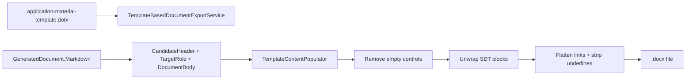

---

## 16. LLM Prompt Architecture

`DraftGenerationService` constructs a system prompt and a user prompt per document kind.

The full prompt surface inventory and quality matrix lives in [LLM Prompt Inventory And Quality Matrix](llm-prompt-inventory.md). Keep that document current when adding prompt surfaces, changing output contracts, or introducing prompt IDs/versions.

### System Prompt (per DocumentKind)

Each system prompt specifies:
- Target language (English or Danish)
- Document kind focus (e.g., "Write a concise {lang} CV for a {role} position at {company}")
- Evidence grounding rule ("grounded strictly in supplied evidence")
- Naming convention for Danish ("Keep technology names, company names, quoted job phrases in their original or English form")
- CV-specific: "Weave as many of the job's key technologies and themes into the professional profile as truthfully possible"
- CV-specific: keep the CV within four pages and do not include recommendations
- Recommendations-specific: write only a compact recommendation brief; deterministic rendering appends the original recommendation quotes with attribution

### User Prompt Structure

The user prompt assembles context from multiple sources into a single structured prompt:

```
Generate a {Kind} in {Language}.

Rules:
- Use only facts from supplied evidence
- Do not invent data
- Do not mention gaps or weaknesses
- Do not expose internal assessment data
- Keep names in original form
- Use job themes only to guide emphasis

Target role: {RoleTitle} at {CompanyName}
Summary: {JobSummary}
Must-have themes: {themes}
Nice-to-have themes: {themes}

Fit review: {score, strengths, gaps}

Candidate: {Name} | {Headline} | {Location} | {Industry}
Summary: {summary}
Certifications: {list}

Experience: {up to 8 most recent roles}

Projects: {all projects}

Company context: {company research text}

Applicant differentiators: {profile lines}

Selected evidence: {ranked evidence items}

Technology context: {detected techs, underrepresented techs}

Recommendations: {all recommendations with author and company}

Additional instructions: {user-supplied per job set}
```

Experience is capped at 8 entries in the prompt with a truncation note. Recommendations and projects are included in full; recommendations are rendered only in the standalone recommendations document.

---

## 17. Streaming Transport and Repetition Detection

### OllamaClient Streaming

`OllamaClient.SendStreamingAsync()` processes NDJSON streaming responses from Ollama, aggregating content and thinking deltas into `StringBuilder` buffers.

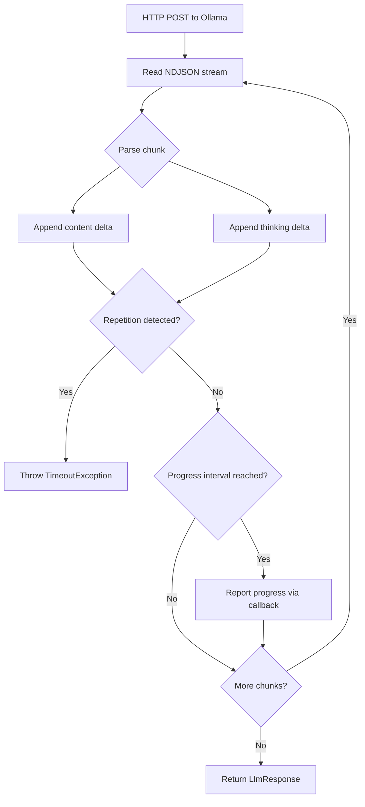

**Progress reporting** occurs at 75ms intervals when new visible content exists. Each update includes: message, detail, model, elapsed time, token counts, thinking preview (last 320 chars), full thinking content, full response content, and sequence number.

**Cumulative deduplication**: `AppendStreamingText()` handles both delta and cumulative streaming modes. If incoming text is a prefix of existing text, it's skipped. If existing text is a prefix of incoming, only the new suffix is appended.

### Repetition Loop Detection

When the LLM enters a degenerate state producing the same phrases repeatedly, the streaming is automatically aborted.

**Algorithm** (`OllamaClient.DetectRepetitionLoop()`):

| Parameter | Value |
| --- | --- |
| `DefaultRepetitionMinLength` | 500 characters — buffer must exceed this before checking |
| `RepetitionMinCycleLength` | 20 characters — smallest repeating pattern to detect |
| `RepetitionMaxCycleLength` | 300 characters — largest repeating pattern to detect |
| `RepetitionRequiredRepeats` | 3 — how many consecutive repetitions trigger detection |

**Detection flow:**
1. If buffer length < `minLength`, skip (not enough data)
2. Sample the tail: `tailLength = min(buffer.Length, MaxCycle × (RequiredRepeats + 1))`
3. For each candidate cycle length from 20 to 300 characters:
   - Extract the last `cycleLength` characters as the candidate pattern
   - Count backward through the tail for exact consecutive matches
   - If matched ≥ 3 times → repetition loop detected
4. When detected, throws `TimeoutException` with descriptive message

**Configuration**: `OllamaOptions.RepetitionDetectionMinLength` (default 500). Set to 0 to disable.

**Applied to**: Both `thinking` and `content` buffers on every streaming chunk (before `done: true`).

### Inactivity Timeout

Independent of repetition detection, `ReadStreamingLineAsync()` applies a per-line inactivity timeout (`OllamaOptions.StreamingInactivitySeconds`, default 90). If no line arrives within the timeout, a `TimeoutException` is thrown.

---

## 18. Telemetry and Diagnostics

`OperationStatusService` is the global activity and LLM telemetry feed. Pages and the broker call into it through `RunAsync()` and LLM progress callbacks.

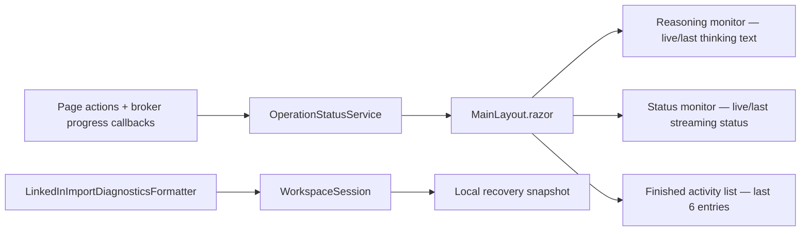

### Telemetry Model

The telemetry model (`LlmOperationTelemetry`) carries:
- Message / detail text
- Selected model name
- Elapsed time
- Prompt and completion token counts
- Estimated remaining time
- Thinking preview (last 320 chars) and full thinking content
- Final response content
- Completion flag
- Event sequence number

### Sidebar Monitors

The shared sidebar surfaces operational state continuously through two retro CRT-styled monitors:

| Monitor | Shows | Badge |
| --- | --- | --- |
| **Reasoning Monitor** | Auto-scrolling thinking text from current or last LLM operation | "Live feed" during streaming, "Last capture" after completion, "Standby" when idle |
| **Status Monitor** | Compact streaming status (model, elapsed, chunk count) | "Live status" during streaming, "Last status" after completion, "Standby" when idle |

The **Activity Panel** below the monitors lists the last 6 completed activity entries with timestamps and durations.

### Current vs. Last Telemetry

When an LLM operation completes (`update.Completed = true`), `OperationStatusService` promotes `currentLlmTelemetry` to `lastCompletedLlmTelemetry` and clears `currentLlmTelemetry`. This transitions the monitor badges from "Live" to "Last capture/status" between multi-step sub-calls, preventing stale first-sub-call thinking from staying visible as "Live feed" while the second sub-call hasn't started.

---

## 19. Deterministic vs. LLM-Backed Behavior

| Concern | Path | Needs session model? | Notes |
| --- | --- | --- | --- |
| Ollama verification | `ILlmClient.VerifyModelAvailabilityAsync()` | No | Checks service reachability |
| Job parsing | `HttpJobResearchService.AnalyzeAsync()` | Yes | LLM structured parsing |
| Company parsing | `HttpJobResearchService.BuildCompanyProfileAsync()` | Yes | LLM structured parsing |
| Insights PDF drafting | `InsightsDiscoveryApplicantDifferentiatorDraftingService.DraftAsync()` | Yes | LLM extraction + field drafting |
| Fit review | `JobFitWorkspaceRefreshService` + optional `LlmFitEnhancementService` via `LlmOperationBroker` | Optional | Deterministic core with semantic enhancement when requested |
| Evidence ranking | `EvidenceSelectionService.Build()` | No | Deterministic once context exists |
| Technology gap | `LlmTechnologyGapAnalysisService.AnalyzeAsync()` | Yes (primary) | Deterministic fallback in analyzer layer |
| Refresh all | `LlmOperationBroker.StartRefreshAllAnalysis()` | Yes | Orchestrates job context, fit review, and technology gap as one streamed operation |
| Draft generation | `DraftGenerationService.GenerateAsync()` via `LlmOperationBroker` | Yes | Wave-based parallel generation + optional refinement pass |
| Document rendering | `MarkdownDocumentRenderer.RenderAsync()` | No | Deterministic Markdown shaping |
| Word export (CV) | `TemplateBasedDocumentExportService.ExportAsync()` | No | Template-based with content controls |
| Word export (other) | `TemplateBasedDocumentExportService.ExportAsync()` | No | Template-based DOCX with content controls |
| Operational status | `MainLayout.razor` and `OperationStatusService` | No | Shared sidebar for live summary and recent activity |

---

## 20. Implementation Boundaries

- Start / Setup is the entry point for session-wide LLM and profile context.
- Any locally available Ollama model works — the user picks during setup.
- Job Workbench research runs job parsing then company-context building sequentially from one button.
- LinkedIn DMA import and CSV data export are both supported import paths.
- First-class typed domains: `PROFILE`, `POSITIONS`, `EDUCATION`, `SKILLS`, `CERTIFICATIONS`, `PROJECTS`, `RECOMMENDATIONS`.
- Enrichment domains preserved as notes: `VOLUNTEERING_EXPERIENCES`, `LANGUAGES`, `PUBLICATIONS`, `PATENTS`, `HONORS`, `COURSES`, `ORGANIZATIONS`.
- Explicitly ignored: `ARTICLES`, `LEARNING`, `WHATSAPP_NUMBERS`, `PROFILE_SUMMARY`, `PHONE_NUMBERS`, `EMAIL_ADDRESSES`.
- Evidence ranking is deterministic; fit review starts from deterministic scoring and can be optionally LLM-enhanced.
- Fit review fingerprinting skips redundant recalculations when inputs haven't changed.
- Session model and thinking settings remain editable after LLM-backed work starts; changes apply to future operations until the user reruns affected analyses or drafts.
- Brokered SSE endpoints exist for job-context, fit-review, technology-gap, refresh-all, and draft-generation operations.
- CV generation uses a wave-based approach (two parallel waves + optional refinement pass for must-have theme coverage).
- CV, recommendations, and other non-CV documents use template-based export with named content controls; recommendations have a dedicated template and other non-CV documents use the focused application-material template.
- All ATS-unfriendly artifacts (SDT blocks, hyperlinks, underlines) are post-processed away before final .docx output.
- Exports are visible-content-only: no app-added hidden ATS XML, hidden candidate/job metadata, hidden keyword stuffing, macros, embedded objects, alt-chunks, or external relationships.
- Repetition loop detection automatically aborts degenerate LLM streaming (configurable, default 500-char threshold).
- Early career roles (end date before 2009) are rendered in compact format; ongoing roles are always modern.
- Umbrella roles covering 3+ projects get inline client sub-items.
- Output language (English/Danish) is per-job-set with automatic recommendation translation annotation in the standalone recommendations document.
- Document export produces both .md and .docx for every generated document.
- CV rendering excludes recommendations; standalone recommendation documents include all recommendations with language detection.
- The shared sidebar carries floating navigation, two CRT monitors, and finished activity history.
- Workspace recovery persists the full session snapshot to JSON for cross-restart continuity.

---

For the primary files index, see [§1 Primary Files](#primary-files).
