# LI CV Writer — Technical Reference

This document is the maintainer, contributor, and evaluator reference for how LI CV Writer works. It covers architecture, data flows, session state, every major pipeline, and the design decisions behind deterministic and LLM-backed behavior.

For the user-facing summary, see [README.md](../README.md).

---

## 1. Architecture Overview

The solution follows a Domain-Driven Design layering where each project has a single responsibility direction and dependencies flow inward.

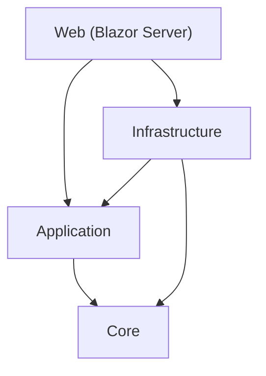

### Project Responsibilities

| Project | Responsibility |
| --- | --- |
| **LiCvWriter.Core** | Domain records: profiles, jobs, documents, auditing. No behavior, no dependencies. |
| **LiCvWriter.Application** | Abstractions (interfaces), deterministic services (fit scoring, evidence ranking, profile merging), models, and options. References Core only. |
| **LiCvWriter.Infrastructure** | Integrations: Ollama LLM client, LinkedIn DMA import, HTTP research, document rendering, Word/Markdown export, audit storage, workspace recovery. References Application and Core. |
| **LiCvWriter.Web** | Blazor Server host: pages, session state, DI registration, operation status. References all layers. |
| **LiCvWriter.Tests** | xUnit test suite covering application services, infrastructure services, and web components. |

### Primary Files

| Concern | Primary files | Purpose |
| --- | --- | --- |
| Bootstrap | [Program.cs](../src/LiCvWriter.Web/Program.cs), [App.razor](../src/LiCvWriter.Web/Components/App.razor), [Routes.razor](../src/LiCvWriter.Web/Components/Routes.razor) | DI, routing, HTTP client configuration |
| Shell | [MainLayout.razor](../src/LiCvWriter.Web/Components/Layout/MainLayout.razor), [NavMenu.razor](../src/LiCvWriter.Web/Components/Layout/NavMenu.razor) | Sidebar, top-level navigation, shared layout |
| Session state | [WorkspaceSession.cs](../src/LiCvWriter.Web/Services/WorkspaceSession.cs), [WorkspaceRecoveryStore.cs](../src/LiCvWriter.Web/Services/WorkspaceRecoveryStore.cs) | In-memory state container, recovery persistence |
| Setup flow | [Home.razor](../src/LiCvWriter.Web/Components/Pages/Home.razor) | Ollama check, model selection, DMA import, differentiators |
| Workbench flow | [JobWorkbench.razor](../src/LiCvWriter.Web/Components/Pages/Workspace/JobWorkbench.razor) | Job research, fit review, evidence, technology gap, generation |
| LinkedIn import | [LinkedInMemberSnapshotImporter.cs](../src/LiCvWriter.Infrastructure/LinkedIn/LinkedInMemberSnapshotImporter.cs), [LinkedInExportImporter.cs](../src/LiCvWriter.Infrastructure/LinkedIn/LinkedInExportImporter.cs) | DMA fetch, domain routing, CSV staging, profile assembly |
| Deterministic scoring | [JobFitAnalysisService.cs](../src/LiCvWriter.Application/Services/JobFitAnalysisService.cs), [EvidenceSelectionService.cs](../src/LiCvWriter.Application/Services/EvidenceSelectionService.cs), [CandidateEvidenceService.cs](../src/LiCvWriter.Application/Services/CandidateEvidenceService.cs) | Fit assessment, evidence ranking, evidence cataloguing |
| LLM research | [HttpJobResearchService.cs](../src/LiCvWriter.Infrastructure/Research/HttpJobResearchService.cs), [LlmTechnologyGapAnalysisService.cs](../src/LiCvWriter.Web/Services/LlmTechnologyGapAnalysisService.cs) | Structured job/company parsing, technology gap analysis |
| Generation | [DraftGenerationService.cs](../src/LiCvWriter.Infrastructure/Workflows/DraftGenerationService.cs) | Orchestrates LLM call → render → export → audit per document kind |
| Document rendering | [MarkdownDocumentRenderer.cs](../src/LiCvWriter.Infrastructure/Documents/MarkdownDocumentRenderer.cs) | Shapes LLM output into structured Markdown with ATS sections |
| Document export | [LocalDocumentExportService.cs](../src/LiCvWriter.Infrastructure/Documents/LocalDocumentExportService.cs) | Writes .md and .docx files via Markdig + HtmlToOpenXml pipeline |
| Diagnostics | [SessionDiagnostics.razor](../src/LiCvWriter.Web/Components/Pages/Diagnostics/SessionDiagnostics.razor), [OperationStatusService.cs](../src/LiCvWriter.Web/Services/OperationStatusService.cs) | Live telemetry, import diagnostics, session inspection |

---

## 2. System Map

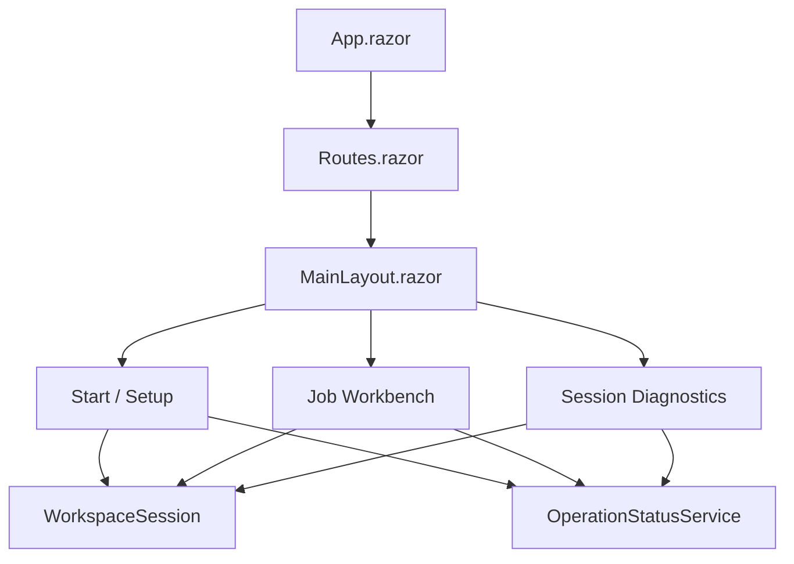

The three pages share `WorkspaceSession` for state and `OperationStatusService` for activity telemetry. Pages subscribe to `WorkspaceSession.Changed` to rerender when upstream state mutates.

---

## 3. Domain Records

### Core/Profiles

| Record | Fields |
| --- | --- |
| `CandidateProfile` | Name, Headline, Summary, Location, Industry, Experience, Education, Skills, Certifications, Projects, Recommendations, ManualSignals |
| `ExperienceEntry` | Title, CompanyName, Description, Period, Location |
| `ProjectEntry` | Title, Description, Period, Url |
| `RecommendationEntry` | Author (PersonName), Company, JobTitle, Text |
| `CertificationEntry` | Name, Authority, Period |
| `EducationEntry` | School, Degree, FieldOfStudy, Period |
| `ApplicantDifferentiatorProfile` | WorkStyle, Communication, Leadership, Stakeholders, Motivators, TargetNarrative, Watchouts, SupportingProofPoints |
| `EvidenceSelectionResult` | RankedEvidence, SelectedEvidence, SelectedEvidenceIds |

### Core/Jobs

| Record | Fields |
| --- | --- |
| `JobPostingAnalysis` | RoleTitle, CompanyName, Summary, MustHaveThemes, NiceToHaveThemes, Requirements, Responsibilities |
| `CompanyResearchProfile` | CompanyName, Industry, Summary, Signals |
| `JobFitAssessment` | OverallScore, Recommendation, Strengths, Gaps, RequirementMatches, HasSignals |
| `TechnologyGapAssessment` | DetectedTechnologies, PossiblyUnderrepresentedTechnologies, HasSignals, HasGaps |

### Core/Documents

| Record | Fields |
| --- | --- |
| `DocumentKind` | Cv, CoverLetter, ProfileSummary, InterviewNotes |
| `GeneratedDocument` | Kind, Title, Markdown, Body, GeneratedAtUtc, OutputPath, LlmDuration, PromptTokens, CompletionTokens, Model |

---

## 4. Session State and Recovery

`WorkspaceSession` is the main in-memory state container. It splits into session-global state and per-job-tab state and raises a `Changed` event for page rerendering.

### State Ownership

| Scope | Container | Examples |
| --- | --- | --- |
| Session-global | `WorkspaceSession` | `CandidateProfile`, `ApplicantDifferentiatorProfile`, `OllamaAvailability`, `SelectedLlmModel`, `SelectedThinkingLevel`, `HasStartedLlmWork`, `LinkedInAuthorizationStatus` |
| Job-tab-local | `JobSetSessionState` | `JobPosting`, `CompanyProfile`, `JobFitAssessment`, `EvidenceSelection`, `TechnologyGapAssessment`, `GeneratedDocuments`, `Exports`, `SelectedEvidenceIds`, `OutputLanguage` |
| Recovery | `WorkspaceRecoveryStore` | Active tab, job-tab inputs, applicant differentiators, selected evidence IDs, output folders |

### Workspace Lifecycle

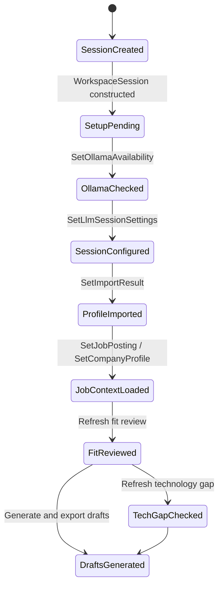

### State Invalidation Rules

These rules prevent stale outputs by clearing downstream results when upstream inputs change.

| Action | Scope | Impact |
| --- | --- | --- |
| `SetImportResult()` | All job tabs | Replaces `CandidateProfile`, stores `ImportResult`, clears generated artifacts, fit assessments, technology gaps, and evidence selections for all tabs |
| `SetApplicantDifferentiatorProfile()` | All job tabs | Stores differentiator profile, clears all fit assessments, clears evidence selections (preserves selected IDs for reranking) |
| `SetJobPosting()` | Active tab | Replaces job posting, resets fit review, technology gap, evidence, progress, generated docs, exports |
| `SetCompanyProfile()` | Active tab | Replaces company profile, resets fit review, technology gap, evidence, progress, generated docs, exports |
| `SetOllamaAvailability()` | Session-global | Updates model availability, clears `IsLlmSessionConfigured` if selected model is no longer available |
| `MarkLlmWorkStarted()` | Session-global | Locks LLM session settings for the remainder of the session |
| `SetGeneratedDocuments()` | Active tab | Marks tab done, stores generated documents and file exports |

---

## 5. Start / Setup Flow

Implemented in [Home.razor](../src/LiCvWriter.Web/Components/Pages/Home.razor). Combines three setup steps with shared status messaging.

### Sequence

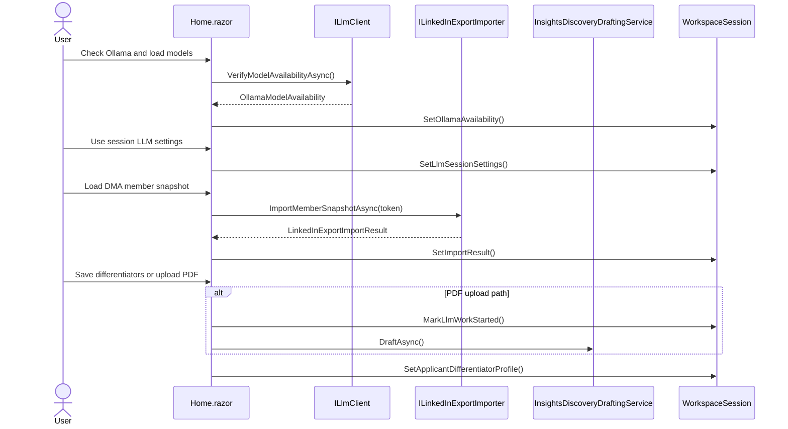

### Step 1: Ollama and Session Model

The page checks Ollama through `ILlmClient.VerifyModelAvailabilityAsync()`. The returned `OllamaModelAvailability` determines which models the user can select. The model and thinking level are session-scoped and remain editable only until LLM-backed work begins (`MarkLlmWorkStarted()`).

The panel is collapsible — after `UseSessionLlmSettingsAsync()`, the controls collapse into a compact shell. Clicking `CheckOllamaAsync()` expands them again if the session is still editable.

### Step 2: LinkedIn DMA Import

Takes a runtime DMA portability token, calls the LinkedIn importer pipeline, updates `WorkspaceSession.ImportResult`, and makes the `CandidateProfile` available to all downstream flows.

### Step 3: Applicant Differentiators

Optional session-global notes (work style, communication, leadership, stakeholders, motivators, target narrative, watchouts, proof points). The manual path is immediate. The PDF path sends extracted text through the session model and locks LLM settings because it calls `MarkLlmWorkStarted()`.

---

## 6. LinkedIn DMA Import

The import is a two-stage pipeline: fetch and route DMA snapshot domains, then parse staged CSV exports into the application profile model.

### Domain Buckets

| Bucket | Domains | Destination |
| --- | --- | --- |
| First-class typed | `PROFILE`, `POSITIONS`, `EDUCATION`, `SKILLS`, `CERTIFICATIONS`, `PROJECTS`, `RECOMMENDATIONS` | Typed `CandidateProfile` fields (Experience, Education, Skills, etc.) |
| Enrichment | `VOLUNTEERING_EXPERIENCES`, `LANGUAGES`, `PUBLICATIONS`, `PATENTS`, `HONORS`, `COURSES`, `ORGANIZATIONS` | `CandidateProfile.ManualSignals` (note-like summaries) |
| Explicitly ignored | `ARTICLES`, `LEARNING`, `WHATSAPP_NUMBERS`, `PROFILE_SUMMARY`, `PHONE_NUMBERS`, `EMAIL_ADDRESSES` | Not imported, not written, no diagnostics warnings |

### Import Pipeline

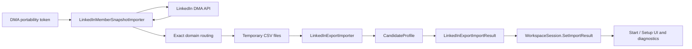

`LinkedInMemberSnapshotImporter` pages through the API, applies the domain registry, and writes temporary export-root files. `LinkedInExportImporter` parses those files and maps them into `CandidateProfile` collections.

The typed/enrichment split is deliberate. Typed collections (Experience, Education, Skills, Certifications, Projects, Recommendations) feed ranking and document generation more strongly than enrichment notes. Enrichment domains in `ManualSignals` preserve extra context without overloading narrower concepts.

### Diagnostics

The diagnostics page reads `WorkspaceSession.ImportResult` and formats it via `LinkedInImportDiagnosticsFormatter` into overview counts, discovered files, experience previews, enrichment notes, and warnings.

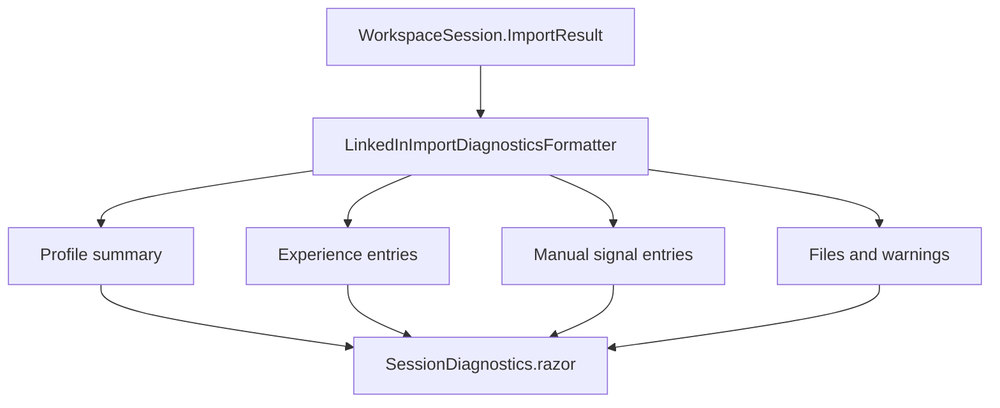

---

## 7. Job Workbench Flow

Implemented in [JobWorkbench.razor](../src/LiCvWriter.Web/Components/Pages/Workspace/JobWorkbench.razor). Each job tab is independent and carries its own state through `JobSetSessionState`.

### Per-Tab State

Each job tab owns: target job URL, company-context URLs, parsed `JobPostingAnalysis`, `CompanyResearchProfile`, `JobFitAssessment`, `EvidenceSelectionResult`, `TechnologyGapAssessment`, output language, generated documents, and exported file paths (.md and .docx).

### End-to-End Pipeline

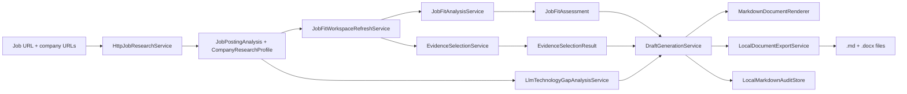

### Research

The workbench uses one combined action: `AnalyzeAndBuildContextAsync()`. It validates URLs, persists input fields, marks LLM work as started, then runs two sequential steps:

1. `ExecuteJobAnalysisAsync()` → `IJobResearchService.AnalyzeAsync()` — fetches and strips HTML from the job URL, sends to LLM for structured parsing, returns `JobPostingAnalysis`
2. `ExecuteCompanyContextAsync()` → `IJobResearchService.BuildCompanyProfileAsync()` — fetches all company-context URLs, sends to LLM, returns `CompanyResearchProfile`

Sequential execution is deliberate: both stages mutate shared page state and telemetry. If job analysis fails, company-context building does not run.

### Fit Review and Evidence Ranking

Refreshed through `JobFitWorkspaceRefreshService`, which coordinates two deterministic services:

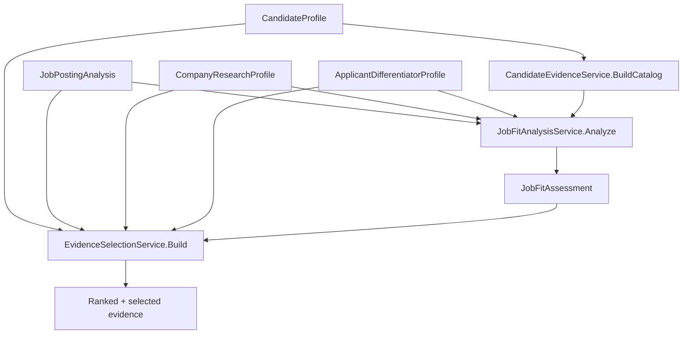

**Fit scoring** — `JobFitAnalysisService` compares the candidate profile against job requirements. Evidence is weighted by type (Experience: 60, Project: 55, Recommendation: 50, Certification: 40, Summary: 20, Headline: 18, Note: 14). Requirements are categorized as must-have, nice-to-have, or cultural, and matched as strong, partial, or missing. The output is a `JobFitAssessment` with an overall score (0–100) and apply/stretch/skip recommendation.

**Evidence cataloguing** — `CandidateEvidenceService.BuildCatalog()` transforms the `CandidateProfile` into a flat catalog of evidence items across seven types: Headline, Summary, Experience, Project, Recommendation, Certification, and Note (manual signals). Deduplication groups by ID and selects the richest variant.

**Evidence ranking** — `EvidenceSelectionService.Build()` multi-criteria ranks the evidence catalog:
- Base score by type (Experience: 24, Project: 20, Recommendation: 18, Certification: 12, Summary: 8, Headline/Note: 6)
- Job requirement match (+18 must-have, +10 nice-to-have, +12 cultural)
- Narrative alignment with differentiator profile (+8)
- Third-party validation for recommendations (+6)
- Concrete work history for experiences with source reference (+4)
- Context term matching against job/company signals (+4)

Returns top 30 ranked items. Evidence selection is interactive — the user can change which items are selected before generating.

### Technology Gap Analysis

LLM-backed, with deterministic fallback. Compares candidate profile against job-detected technologies and company signals to surface possibly underrepresented technologies. Returns `TechnologyGapAssessment` with detected technologies and gap candidates.

---

## 8. Document Rendering and Export

Document generation is a three-stage pipeline orchestrated by `DraftGenerationService`: LLM generation → Markdown rendering → file export.

### Generation Orchestration

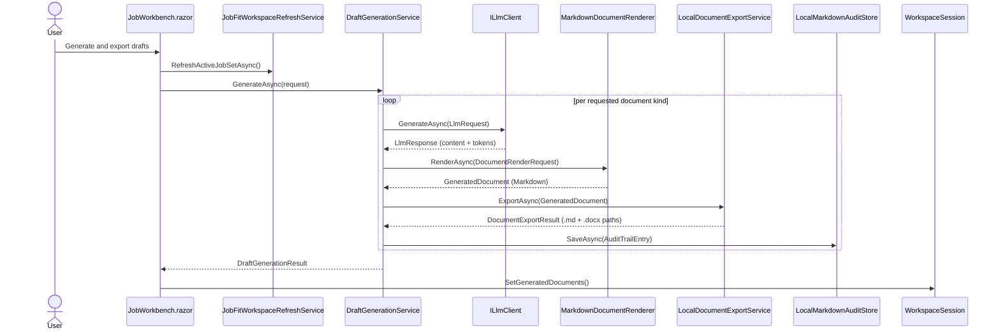

### Markdown Rendering — MarkdownDocumentRenderer

The renderer shapes LLM-generated body text into structured Markdown with ATS-friendly section titles. The output varies by `DocumentKind`:

**CV rendering flow:**

1. **Header** — candidate name (H1), headline (blockquote), target role section
2. **Professional Profile** — LLM-generated profile overview + keyword line
3. **Fit Snapshot** — strengths and overall score from `JobFitAssessment`
4. **Professional Experience** — up to 12 entries with Title | Company (H3), period, description
5. **Projects** — all `CandidateProfile.Projects` with title, period, description, URL
6. **Recommendations** — all recommendations with author/company/title and language annotation
7. **Certifications** — from selected evidence items of type Certification

**Other document kinds:**
- **Cover Letter** — letter body + fit snapshot + applicant angle + selected evidence
- **Profile Summary** — summary body + applicant angle + certifications
- **Interview Notes** — talking points + fit snapshot + selected evidence + recommendations (if not already in evidence)

### Keyword Line (ATS Optimization)

`BuildKeywordLine()` cross-references the job's `MustHaveThemes`, `NiceToHaveThemes`, and `TechnologyGapAssessment.DetectedTechnologies` against evidence tags from the selected evidence. Only terms the candidate has evidence for are included. Output: a comma-separated "Key Technologies & Competencies" line under the professional profile.

### Language Detection and Translation Annotation

`AppendAllRecommendations()` annotates each recommendation with translation context when the recommendation language differs from the output language.

Detection uses `DetectDanish()`, a word-frequency heuristic:
- Scans all words against a 36-word `DanishMarkers` set (common Danish function words: "og", "er", "med", "har", "det", "en", "af", "til", etc.)
- Requires minimum 5 words in the text
- Threshold: 8% Danish marker ratio → classified as Danish
- Returns `true` for Danish text, `false` for English or inconclusive

`GetTranslationAnnotation()` compares detected language against output language:
- Danish text + English output → " *(translated from Danish)*"
- English text + Danish output → " *(translated from English)*"
- Same language → empty string

### Word (.docx) Export Pipeline

`LocalDocumentExportService` writes both Markdown and Word files for every exported document.

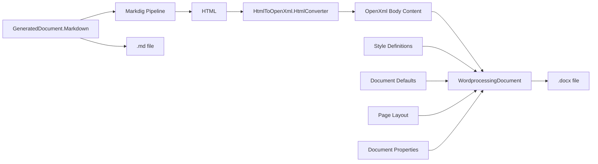

**Pipeline steps:**

1. **Markdown → HTML** — Markdig with `UseAdvancedExtensions()` converts the rendered Markdown to HTML
2. **HTML → OpenXml** — `HtmlConverter.ParseBody()` from HtmlToOpenXml converts HTML elements into OpenXml body content
3. **Style injection** — `AddStyleDefinitions()` creates built-in Word heading styles (Heading1: 14pt, Heading2: 12pt, Heading3: 11pt) plus Normal body style, all Calibri
4. **Document defaults** — `AddDocumentDefaults()` sets Calibri 11pt, 1.15 line spacing, 120 twips after-paragraph spacing
5. **Page layout** — `SetSingleColumnLayout()` applies 1-inch margins on all sides
6. **Metadata** — `SetDocumentProperties()` writes `dc:title` and `dc:subject` to `CoreFilePropertiesPart` for ATS metadata extraction

### ATS/AI Readability Design Decisions

| Decision | Rationale |
| --- | --- |
| Built-in Word heading styles (`heading 1`, `heading 2`, `heading 3`) | ATS parsers recognize built-in heading styles; custom styles are often ignored |
| Single-column layout | Multi-column and table-based layouts confuse most ATS parsers |
| No tables for content layout | Tables are for data only; using them for layout breaks ATS reading order |
| Standard section titles ("Professional Profile", "Professional Experience", "Projects", "Recommendations") | ATS parsers match against known section name patterns |
| Calibri font throughout | Universal, clean, highly readable sans-serif |
| Document metadata (title, subject) | Some ATS systems extract metadata for candidate identification |
| Keyword-rich profile line | Increases ATS keyword match rate for technology skills |

---

## 9. LLM Prompt Architecture

`DraftGenerationService` constructs a system prompt and a user prompt per document kind.

### System Prompt (per DocumentKind)

Each system prompt specifies:
- Target language (English or Danish)
- Document kind focus (e.g., "Write a concise {lang} CV for a {role} position at {company}")
- Evidence grounding rule ("grounded strictly in supplied evidence")
- Naming convention for Danish ("Keep technology names, company names, quoted job phrases in their original or English form")
- CV-specific: "Weave as many of the job's key technologies and themes into the professional profile as truthfully possible"
- CV-specific: "If any recommendation text is not in {lang}, translate it to {lang} and append '(translated from \<original language\>)'"

### User Prompt Structure

The user prompt assembles context from multiple sources into a single structured prompt:

```
Generate a {Kind} in {Language}.

Rules:
- Use only facts from supplied evidence
- Do not invent data
- Do not mention gaps or weaknesses
- Do not expose internal assessment data
- Keep names in original form
- Use job themes only to guide emphasis

Target role: {RoleTitle} at {CompanyName}
Summary: {JobSummary}
Must-have themes: {themes}
Nice-to-have themes: {themes}

Fit review: {score, strengths, gaps}

Candidate: {Name} | {Headline} | {Location} | {Industry}
Summary: {summary}
Certifications: {list}

Experience: {up to 8 most recent roles}

Projects: {all projects}

Company context: {company research text}

Applicant differentiators: {profile lines}

Selected evidence: {ranked evidence items}

Technology context: {detected techs, underrepresented techs}

Recommendations: {all recommendations with author and company}

Additional instructions: {user-supplied}
```

Experience is capped at 8 entries in the prompt with a truncation note. Recommendations and projects are included in full.

---

## 10. Telemetry and Diagnostics

`OperationStatusService` is the global activity and LLM telemetry feed. Pages call into it through `RunAsync()` and LLM progress callbacks.

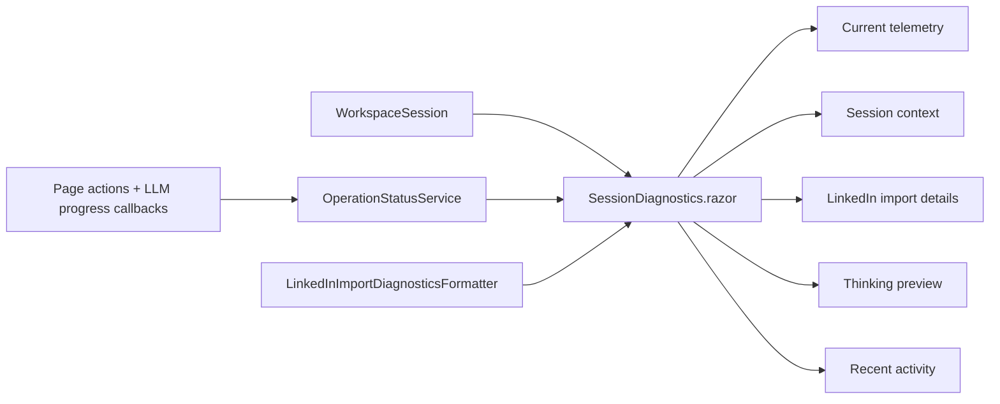

The diagnostics page carries verbose operational detail: live LLM progress, token counts, per-import file inventories, and the current thinking preview when available. The setup and workbench pages stay lighter.

---

## 11. Deterministic vs. LLM-Backed Behavior

| Concern | Path | Needs session model? | Notes |
| --- | --- | --- | --- |
| Ollama verification | `ILlmClient.VerifyModelAvailabilityAsync()` | No | Checks service reachability |
| Job parsing | `HttpJobResearchService.AnalyzeAsync()` | Yes | LLM structured parsing |
| Company parsing | `HttpJobResearchService.BuildCompanyProfileAsync()` | Yes | LLM structured parsing |
| Insights PDF drafting | `InsightsDiscoveryDraftingService.DraftAsync()` | Yes | LLM extraction + field drafting |
| Fit review | `JobFitAnalysisService.Analyze()` | No | Deterministic once context exists |
| Evidence ranking | `EvidenceSelectionService.Build()` | No | Deterministic once context exists |
| Technology gap | `LlmTechnologyGapAnalysisService.AnalyzeAsync()` | Yes (primary) | Deterministic fallback in analyzer layer |
| Draft generation | `DraftGenerationService.GenerateAsync()` | Yes | Uses session model + thinking level |
| Document rendering | `MarkdownDocumentRenderer.RenderAsync()` | No | Deterministic Markdown shaping |
| Word export | `LocalDocumentExportService.ExportAsync()` | No | Deterministic Markdown → HTML → DOCX |
| Diagnostics | `SessionDiagnostics.razor` + formatters | No | Reads stored state and telemetry |

---

## 12. Implementation Boundaries

- Start / Setup is the entry point for session-wide LLM and profile context.
- Any locally available Ollama model works — the user picks during setup.
- Job Workbench research runs job parsing then company-context building sequentially from one button.
- LinkedIn DMA import is the only supported import path.
- First-class typed domains: `PROFILE`, `POSITIONS`, `EDUCATION`, `SKILLS`, `CERTIFICATIONS`, `PROJECTS`, `RECOMMENDATIONS`.
- Enrichment domains preserved as notes: `VOLUNTEERING_EXPERIENCES`, `LANGUAGES`, `PUBLICATIONS`, `PATENTS`, `HONORS`, `COURSES`, `ORGANIZATIONS`.
- Explicitly ignored: `ARTICLES`, `LEARNING`, `WHATSAPP_NUMBERS`, `PROFILE_SUMMARY`, `PHONE_NUMBERS`, `EMAIL_ADDRESSES`.
- Fit review and evidence ranking are fully deterministic.
- Session LLM settings lock after the first LLM-backed operation.
- Document export produces both .md and .docx for every generated document.
- CV rendering includes all recommendations (not just selected evidence) with language detection.
- The diagnostics page is the verbose inspection surface; workflow pages stay clean.

---

## Cross-References

| File | Role |
| --- | --- |
| [README.md](../README.md) | User-facing overview |
| [Home.razor](../src/LiCvWriter.Web/Components/Pages/Home.razor) | Start / Setup |
| [JobWorkbench.razor](../src/LiCvWriter.Web/Components/Pages/Workspace/JobWorkbench.razor) | Job Workbench |
| [WorkspaceSession.cs](../src/LiCvWriter.Web/Services/WorkspaceSession.cs) | Session state |
| [LinkedInMemberSnapshotImporter.cs](../src/LiCvWriter.Infrastructure/LinkedIn/LinkedInMemberSnapshotImporter.cs) | DMA import |
| [LinkedInExportImporter.cs](../src/LiCvWriter.Infrastructure/LinkedIn/LinkedInExportImporter.cs) | CSV → profile mapping |
| [JobFitAnalysisService.cs](../src/LiCvWriter.Application/Services/JobFitAnalysisService.cs) | Fit scoring |
| [EvidenceSelectionService.cs](../src/LiCvWriter.Application/Services/EvidenceSelectionService.cs) | Evidence ranking |
| [CandidateEvidenceService.cs](../src/LiCvWriter.Application/Services/CandidateEvidenceService.cs) | Evidence cataloguing |
| [DraftGenerationService.cs](../src/LiCvWriter.Infrastructure/Workflows/DraftGenerationService.cs) | Generation orchestration |
| [MarkdownDocumentRenderer.cs](../src/LiCvWriter.Infrastructure/Documents/MarkdownDocumentRenderer.cs) | Markdown rendering |
| [LocalDocumentExportService.cs](../src/LiCvWriter.Infrastructure/Documents/LocalDocumentExportService.cs) | .md + .docx export |
| [SessionDiagnostics.razor](../src/LiCvWriter.Web/Components/Pages/Diagnostics/SessionDiagnostics.razor) | Diagnostics |
| [Verify-GitHubPushSafety.ps1](../scripts/Verify-GitHubPushSafety.ps1) | Pre-push safety check |
