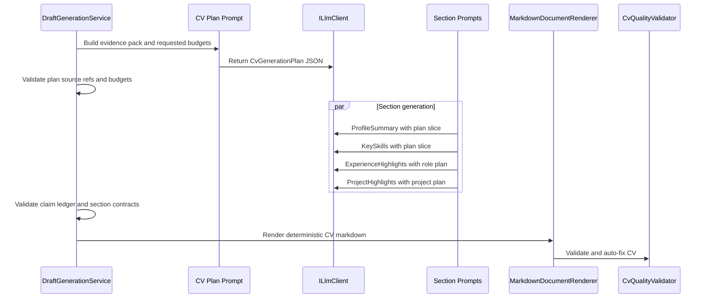

# Outline-First Chunked CV Generation Design

Date: 2026-04-29

This design evolves the current section-based CV generation into an outline-first workflow. The goal is better global coherence, stronger evidence grounding, and less repeated work, while keeping the deterministic renderer, visible-content-only export policy, and four-page CV policy intact.

## Current Baseline

`DraftGenerationService` already generates CV content in chunks:

1. Wave 1: `ProfileSummary` and `KeySkills` in parallel.
2. Wave 2: `ExperienceHighlights` and optional `ProjectHighlights` in parallel.
3. Conditional refinement: `RefineExperienceHighlightsAsync` improves the experience section when must-have themes are missing.
4. `MarkdownDocumentRenderer` merges generated sections with deterministic candidate header, education, certifications, languages, early career, and recommendation omission.
5. `CvQualityValidator` trims, reorders, and reports ATS/page-budget quality signals.

The missing piece is shared intent. Each section currently sees the same source inputs, but it does not receive a compact plan that says which evidence belongs where, what claims are allowed, which themes have priority, and how much space each section may spend.

## Target Shape

Add one planning step before section generation:



## Proposed Contracts

### `CvGenerationPlan`

The planning call should return JSON only:

```json
{
  "targetNarrative": "Senior, evidence-backed positioning for the target role",
  "mustHavePriorities": ["Azure", "Stakeholder management"],
  "excludedTopics": ["Unsupported Kubernetes ownership"],
  "sectionBudgets": {
    "profileSummaryLines": 4,
    "keySkillsTerms": 18,
    "experienceBulletsPerRole": 3,
    "projectBulletsPerProject": 2
  },
  "sectionPlans": [
    {
      "section": "ExperienceHighlights",
      "sourceIds": ["experience:lead-architect", "recommendation:cto"],
      "allowedClaims": ["Led Azure platform delivery"],
      "keywordsToInclude": ["Azure", "architecture"],
      "notes": "Prioritize delivery scale and stakeholder trust."
    }
  ]
}
```

Rules:

- Every `sourceIds` value must refer to a deterministic source item already present in the evidence pack.
- `excludedTopics` is mandatory when gaps or thin evidence exist.
- Budgets are hints, not final authority; `CvQualityValidator` remains the final length guard.
- The plan is internal guidance only and must never appear directly in exported documents.

### `CvSectionDraft`

Each generated section should eventually return JSON rather than raw markdown:

```json
{
  "section": "ExperienceHighlights",
  "markdown": "### Lead Architect | Contoso | 2021 - Present\n\n- Led Azure platform delivery...",
  "claims": [
    {
      "claim": "Led Azure platform delivery",
      "sourceIds": ["experience:lead-architect"],
      "confidence": "high"
    }
  ]
}
```

The renderer should still receive `CvSectionMarkdown` after validation. The claim ledger is for audit, quality checks, and future local evals. It is not exported as hidden metadata.

## Evidence Pack

Use deterministic source IDs before any LLM call:

| Source Type | Example ID | Notes |
| --- | --- | --- |
| Experience | `experience:{slug}` | Title, company, period, description, tags |
| Project | `project:{slug}` | Title, period, description, related role if known |
| Recommendation | `recommendation:{slug}` | Author, company, text excerpt, language |
| Education | `education:{slug}` | Deterministic renderer usually owns this |
| Certification | `certification:{slug}` | Prefer selected evidence before listing |
| Manual signal | `manual:{key}` | Treat as user-provided evidence, not instruction override |
| Fit review | `fit:{requirement}` | Internal emphasis guidance only, never final text |

The evidence pack should be compact and source-boundary protected. Job/company/source/profile text remains evidence only and cannot change schema, safety rules, output language, or format.

## Validation

Before accepting a plan or section draft:

1. Reject unknown `sourceIds`.
2. Reject claims without at least one supporting source ID.
3. Reject role/company/date mutations for experience and projects.
4. Reject recommendations inside the CV body.
5. Reject hidden metadata dependencies or instructions to create invisible ATS content.
6. Fallback to the current section-generation path if planning fails.

After rendering:

1. Keep `CvQualityValidator` as the final page budget and ATS coverage gate.
2. Keep deterministic education, certifications, languages, and early career rendering unless the plan later proves those need controlled variation.
3. Keep Word export visible-content-only.

## Harmonization Pass

The final harmonization pass should be optional and conservative. It should not freely rewrite the full CV at first. Prefer a JSON response with targeted actions:

```json
{
  "issues": ["Azure appears in profile and every role bullet"],
  "sectionReplacements": [
    {
      "section": "ProfileSummary",
      "markdown": "Replacement markdown",
      "reason": "Remove duplicate wording while preserving target narrative"
    }
  ]
}
```

Accept replacements only when they pass the same section validation rules.

## Non-Goals

- Do not generate bullet-by-bullet micro-prompts.
- Do not append sections blindly without a shared plan.
- Do not replace deterministic rendering for header, education, languages, and early career in the first implementation.
- Do not export the plan, ledger, prompt text, fit scores, gaps, or hidden ATS metadata.
- Do not require cloud tracing or non-local eval infrastructure.

## Implementation Phases

1. Add internal plan and ledger models plus deterministic source-ID generation.
2. Add a `CvGenerationPlan` prompt using `LlmJsonInvoker`, with fallback to the current section flow.
3. Thread plan slices into existing section prompts while still returning markdown.
4. Move section outputs to `CvSectionDraft` JSON with claim ledger validation.
5. Add optional conservative harmonization actions.
6. Add local golden eval fixtures for coherence, grounding, page budget, keyword coverage, no recommendations in CV, and no internal-data leakage.

## Test Plan

- Unit-test source-ID generation for stable IDs and no collisions on common profile shapes.
- Unit-test plan validation rejects unknown sources, empty evidence, unsupported claims, and over-budget section plans.
- Unit-test fallback when the plan response is invalid or low quality.
- Prompt tests should assert JSON-only, source-boundary, visible-content-only, output language, no hidden metadata, no fit-score leakage, and no recommendations in CV.
- Renderer tests should prove the deterministic sections still render when plan generation fails.
- Quality tests should prove the four-page and no-recommendations policies still win over LLM output.