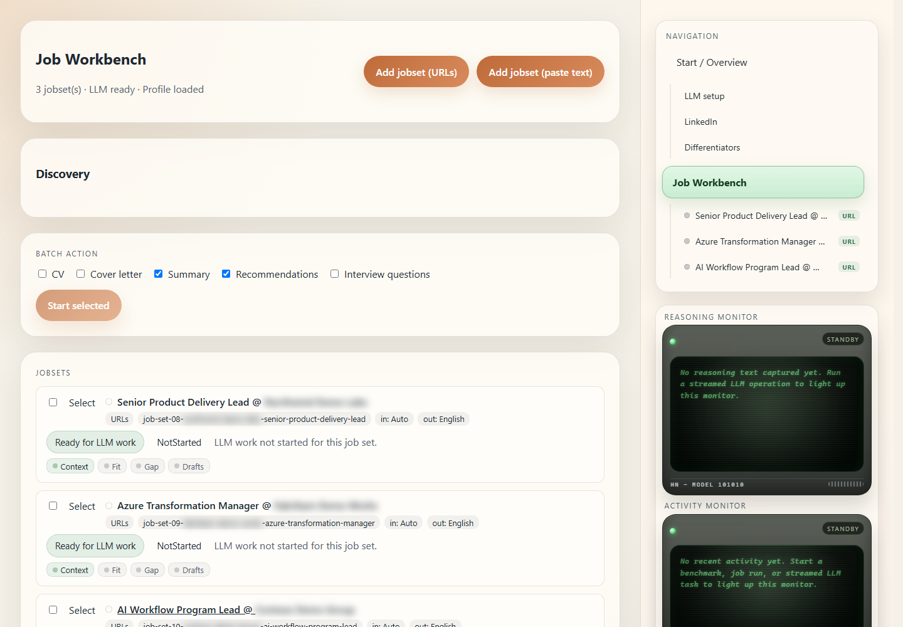
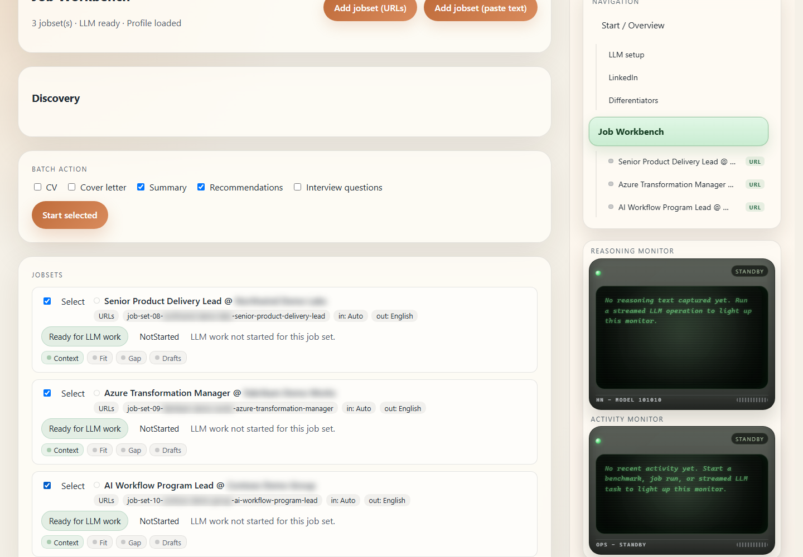
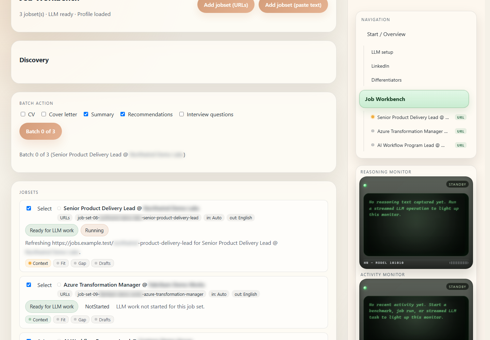
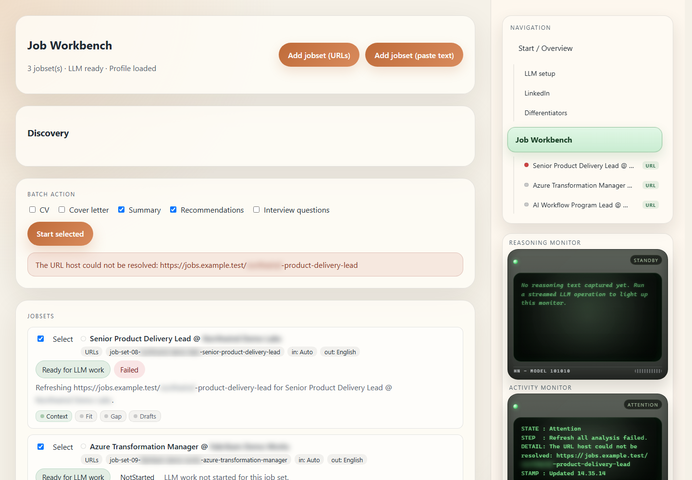

# Playwright Demo Assets

These demo assets are generated from local Playwright sessions against the LI-CV-Writer web app. The canonical tracked WebM is a full-app E2E walkthrough, while the screenshots below capture key Job Workbench batch states.

Company names in screenshots and video are blurred by the Playwright masking helper before media is captured. Review the video before sharing outside the local workspace so privacy masking is confirmed across the full recording.

Watch the recording on [the browser-playable Playwright demo page](https://hennie42.github.io/li-jobber/playwright-demo.html).

## Screenshot Walkthrough

1. Open the Job Workbench with a loaded profile, a live Ollama model, and three ready job sets.
2. Review each job-set row while the company-name masking remains visible.
3. Select the three job sets in the batch list.
4. Click Start selected.
5. Watch the batch label, job-set status chips, Status Monitor, Reasoning Monitor, and Activity feed update while the LLM operation runs.

## Video

The full-app recording is tracked in the repository as [the LI-CV-Writer WebM walkthrough](assets/playwright-job-workbench-demo/job-workbench-demo.webm), so it is available from the online repo as well as the local workspace.

A local copy of the WebM and the diagnostic Playwright trace are also written under `artifacts/playwright/` when the demos are regenerated.

## Video Transcript

1. The recording opens on Start / Setup with LLM readiness, profile status, differentiators, and job-set count visible.
2. It reviews the imported profile tabs, including experience, education, skills, certifications, projects, recommendations, and notes.
3. It shows the redirect pages that now fold import, research, and generation back into the main setup and workbench flows.
4. It walks through the Job Workbench overview, discovery, batch action settings, and job-set rows.
5. It opens a job-set detail page to show research, fit review, technology gap, ranked evidence, draft generation, generated markdown drafts, and exported files.
6. It returns to the overview, selects three job sets, clicks Start selected, and holds on live Status Monitor, Reasoning Monitor, and Activity feed updates.

## Validation

The artifact validators check that all expected screenshots exist, PNG dimensions are plausible, markdown links resolve, the tracked WebM has an EBML header, the WebM is larger than the configured threshold, and the trace archive contains trace and resource entries.
